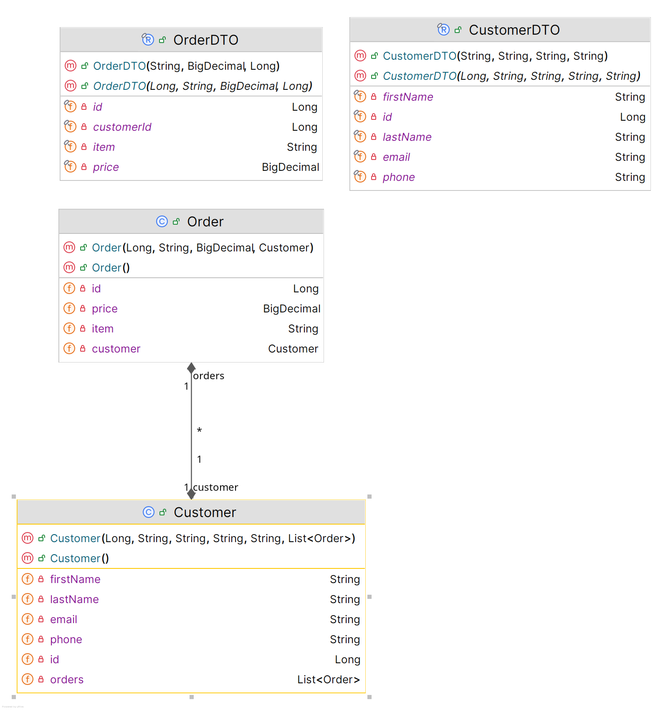
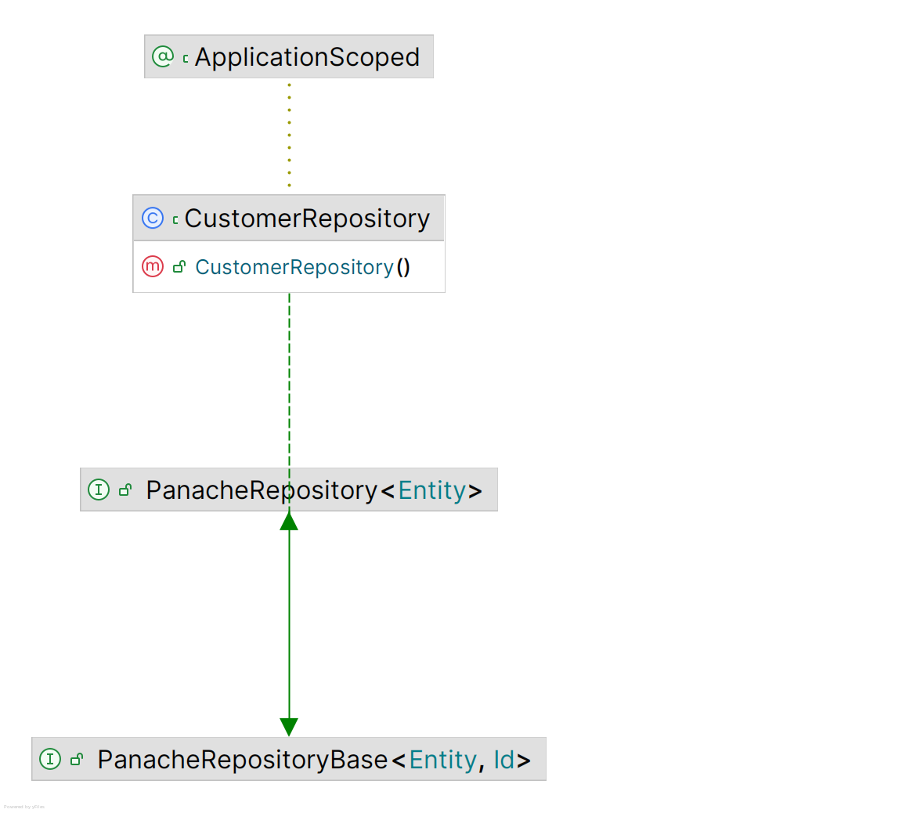
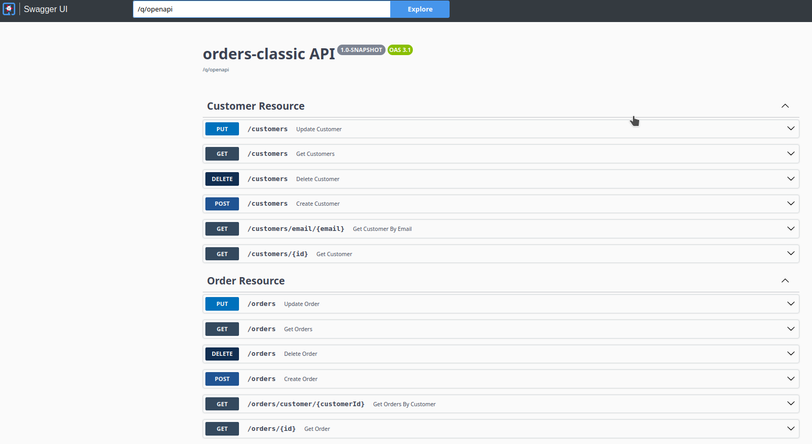

\pagebreak
\tableofcontents
\pagebreak

\maketitle

# Quarkus: 50 Shades of RESTful Services

REST is now 25 years old. The birth certificate of this almost impossible to 
remember acronym (*REpresentational State Transfer*) is considered to be the Y2K
doctoral dissertation of Roy Fielding, which aimed at creating a *standard* software
architecture, making easier the communication between systems using HTTP (*HyperText
Transfer Protocol*).

25 years is a long time and, at the IT scale, it's even much longer. We could 
think that, after a so long period of practising and testing, this paradigm has 
yielded up all its secrets. But no, screams often our daily activity, constraining
us to observe exactly the opposite.

Hence, the idea of this booklet which tries to address the essential aspects 
of this old, yet unknown, web technology, from its most basic features, like verbs
and resource naming conventions, to the most advanced ones, like non-blocking, 
asynchronous or reactive processing, together with the whole diversity of the REST
clients, blocking or non-blocking, synchronous or asynchronous, reactive or classic.

And since in order to illustrate the discourse we need code examples, I chose to
write them in Java, with its [supersonic subatomic dedicated stack](https://quarkus.io/), 
that doesn't need any longer presentation.

## A bit of history

In the begging there was nothing. Before the 70s, there weren't networks at all.
Computers were standalone boxes, like the one in the figure below, which didn't communicate 
each other. No files transfer, no remote access, no email, no internet, nothing.

### Arpanet, IBM SNA, DECnet and friends

This started to change in the beginning '70s with the birth of the ARPANET. 
But it wasn't until the end of the '70s that ARPANET became a backbone with 
several hundreds of nodes, using as processors minicomputers that later 
became routers. ARPANET was a network of networks, an inter-network, hence
the Internet that it became later.

ARPANET was based on TCP/IP (*Transmission Control Protocol/Internet Protocol*),
the first network protocol which continues to be the *lingua franca* of our 
nowadays internet. However, starting with the beginning of the '80s, other network
protocols have raised as well. Among the most famous were IBM SNA (*System Network
Architecture* ) and DECnet (*Digital Equipment Coorportaion net*). They were both
proprietary, yet popular network architectures connecting mainframes, minicomputers
peripheral devices like teleprinters and displays, etc.

IBM SNA and DECnet have competed until early '80s when another protocol, OSI (*Open 
System Interconnect*), backed by European telephone monopolies and most governments,
was favored. Well-defined and supported by many state organizations, OSI became
quickly an ISO (*International Standardization Organization*) standard and was 
in the process of imposing itself on the market,
but it suffered from too much complexity and, finally, it gave way to TCP/IP which
was already a *de-facto* standard. Accordingly, at the end of the '80s, the network 
protocols war was finished and TCP/IP was the winner.

### RPC

But the network protocols wasn't the only war that took place in that period. 
Once that the computer networks became democratic and affordable, new distributed 
software applications started to emerge. These applications weren't designed 
anymore to run in a single isolated box but as standalone components, on different
nodes of the network. And in order to communicate, in order that local components
be able to call remote ones, software communication protocols were required.

The first major software communication protocol was RPC (*Remote Procedure Call*),
developed by SUN Microsystems in the 80s. One of the first problems that the 
distributed computing had to solve was the fact that, in order to perform a remote
call, the caller needs to capture the essence of the callee. A call to another
component, be it local or remote, needs to be compiled and, in order to be compiled, 
the callee procedure needs to be known by the compiler, such that it can translate
its name to a memory address. But when the callee is located on a different node
than the caller, the compiler cannot know the callee procedure since it is remote.
Hence, the notion of *stub*, i.e. a local proxy of the remote procedure that, when
called, transforms the local call into remote one. 

Which means that, in order to call a remote procedure, in addition of the two 
components, the caller and the callee, a caller stub able to transform the local
call into a remote one, as well as a callee stub, able to transform the local return 
into a remote one, are required. These stubs are very complex artifacts and coding
them manually would have been a nightmare for the poor programmer. One of the 
greatest merits of RPC was to recognize the difficulty of such an undertaking and
to provide `genrpc`, a dedicated tool to generate the stubs using a standard 
format, named XDR (*eXternal Data Representation*), in a way the grandfather of
the nowadays' XML and JSON.

RPC was a big success as it proposed a rather straightforward model for distributed
applications development in C, on Unix operating system. But like any success, it 
has been forgotten as soon as other new and more interesting paradigms have 
emerged.

### DCOM

Nevertheless, the success of RPC has encouraged other software editors to take
a real interest in this new paradigm called henceforth *middleware* and which
allowed programs on different machines to talk each other. Microsoft, for example,
adopted RPC but, living up to its reputation, modified it and, in the early '90s,
released a specific Windows NT version of it, known as MSRPC. Several years later,
in September 1996, Microsoft launched DCOM (*Distributed Component Object Model*).

Based on MSRPC and on RPC, which underlying mechanism it was using, DCOM imposed
itself as a new middleware construct supporting OOP (*Object Oriented Programming*).
The OOP support provided by DCOM was great progress compared with the RPC layer
as it allowed a higher abstraction level and to manipulate complex types instead 
of the XDR basic ones.

Unlike RPC and MSRPC accessible only in C, DCOM supported MS Visual C/C++ and 
Visual Basic. However, like all the Microsoft products, DCOM was tied to Windows 
and, hence, unable to represent a reliable middleware, especially in heterogeneous
environments involving different hardware, operating systems and programming languages.

### CORBA

The *Common Object Request Broker Architecture* is an OMG (*Object Management 
Group*) standard that emerged in 1991 and which aimed at bringing solutions to
the DCOM's most essential concerns, especially its associated vendor lock-in 
pattern that made its customers dependent on the Windows operating system.

As a multi-language, multi-os and multi-constructor platform, Corba was the first
true distributed object-oriented middleware. It replaced the `rpcgen` utility, inherited 
from RPC and MSRPC, by IDL (*Interface Definition Language*), a plain text notation.
And instead of the old XDR, the IDL compiler generated C++ or Java code directly.

Corba has definitely been a major player in the middleware history thanks to its
innovative architecture based on components like POA (*Portable Object Adapter*),
PI (*Portable Interceptors*), INS (*Interoperable Naming Service*) and many others.

But Corba was complex and required a quite steep learning curve. Its approach was
powerful but using it carelessly could have led to terrible applications, impacting
dramatically the infrastructure performances. Moreover, it was based on IIOP 
(*Internet Inter ORB Protocol*), an unfriendly firewall communication protocol
that used raw TCP/IP connections to transmit data.

All these aspects made feel like, despite Corba's great qualities, the community 
wasn't yet ready to adopt the first distributed object-oriented middleware.

### RMI

Positioned initially as the natural outgrowth of Corba, RMI (*Remote Method 
Invocation*) has been introduced with JDK (*Java Development Kit*) 1.1, in 1997.
One year later, JDK 1.2 introduced Java IDL and `idl2java`, the Java counterpart 
of Corba's IDL, supporting IIOP. 

In 1999, the RMI/IIOP extension to the JDK 1.2 enabled the remote access of any
Java distributed objects from any IIOP supported language. This was a major 
evolution as it delivered Corba distributed capabilities to the Java platform.

Two years later, in 2001, the JDK 1.4 introduced support for POA, PI and 
INS, signing this way the Corba's death sentence. A couple of the most widespread
implementations, like Borland's VisiBroker or Iona's Orbix, have still subsisted
until 2003, when they got lost into oblivion.

From now on, Java RMI became the universal distributed object-oriented object model.

### Jakarta Enterprise Beans (EJB)

In 1999, SUN Microsystems has released the first version of what they're calling
the Java Enterprise platform, named a bit confusing J2EE (*Java 2 Enterprise 
Edition*). This new Java based framework was composed of 4 specifications: JDBC
(*Java Data Base Connection*), EJB (*Enterprise Java Beans*), Servlet and JSP 
(*Java Server Pages*). In 2006 J2EE became Java EE and, 11 years later, in 2017,
it changed again its name to become Jakarta EE.

Between 1999 and today, the Jakarta EE specifications have evolved dramatically.
Started with the previous mentioned 4 subprojects, they represent today more 
than 30. But the EJB specifications, currently named Jakarta Enterprise Beans,  
remain among the most the innovative Java APIs, the legitimate heir of Java RMI.

Enhanced under the JCP (*Java Community Process*) as JSR (*Java Specification 
Request*) 19 (EJB 2.0), JSR 153 (EJB 2.1), JSR 220 (EJB 3.0), JSR 318 (EJB 3.1)
and JSR 345 (EJB 3.2), these specifications provide even today the standard way
to implement the server-side components, often called the backend. They handle 
common concerns in enterprise grade applications, like security, persistence, 
transactional integrity, concurrency, remote access, race conditions management,
and others.

### Jakarta XML Web Services (JAX-WS)

While Jakarta Enterprise Beans compliant components were the standard solution 
to implement and encapsulate business logic, a new markup notation for storing, 
transmitting and reconstructing arbitrary data, has emerged. This notation, named 
XML (*eXtended Markup Language*), finished by being adopted as a standard by WWW
(*World Wide Web*) consortium, in 1999. And as that's often the case in the IT 
history, barely adopted, it immediately became so essential, so much so that it 
was quickly considered that any XML application was mandatory great. 

Consequently, it didn't need much to architectures boards to consider that 
exchanging XML documents, instead of RMI/IIOP Jakarta Enterprise Beans payloads,
would be easier and more proficient. It was also considered that Jakarta 
Enterprise Beans was heavy because it required stubs to be automatically downloaded
from servers to clients and, once downloaded, these stubs acted like client-side
objects, making remote calls. This required that the byte-code for the various
programmer-defined Java classes be available on the client machine and, this setup
was considered a significant challenge.

The alternative was the so-called *web services*, a newly coined concept supposed 
to simplify the distributed processing. According to this new paradigm, clients
and servers would exchange XML documents, i.e. text data. This documents grammar
is described by a new notation, called XSD (*XML Schema Defintion*), having the 
same capabilities as an object-oriented programming language, supporting inheritance,
polymorphism, etc. This XSD notation was to the web services what XDR was to RPC.

As for the interface contracts between clients and servers, another new XML based 
notation, called WSDL (*Web Service Definition Language*), was required. Last but 
not least, the payload exchanged between clients and servers was expressed using a 
yet another new XML based notation, called SOAP (*Simple Object Access Protocol*)
which, despite its name, was anything but simple. The funy thing is that all this
huge labyrinth was considered simpler that the old good Jakarta Enterprise Beans
components.

Nevertheless, all this madness became standard in 2003, as JSR 101, known also
under the name of JAX-RPC (*Java API for XML-Based RPC*) and later, in 2017 as 
JSR 224, named JAX-WS (*Java API for XML-Based Services*). These specifications 
gave rise to a lot other, including but not limited to WS-I Basic Profile, WS-I
Attachments, WS-Addressing, SAAJ, etc.

### Jakarta RESTful Web Services (JAX-RS)

After this so convoluted piece of history, we come finally at the end of our 
journey, in 2009, when the specifications JAX-RS became a part of Java EE 6. Today,
in 2024, they are named Jakarta RESTful Web Services and are a part of Jakarta EE 11.
Since 15 years they represent the main substratum making service and microservices 
to communicate each-other, as well as with the external world.

In this post series we'll examine all their 50 shades :-).

# 101 RESTful services

As we've seen, RESTful services are services that follow the *Representation State 
Transfer* principles. They are based on manipulating resources addressable via 
their URLs (*Unified Resource Locator*), which can contain static or dynamic data.

RESTful resources have their own URLs and are handled through HTTP methods (`GET`, `POST`, 
`PUT`, `DELETE`, etc.) to perform different operations like, for example, CRUD-ing
or using them wherever efficient communication over the web is crucial.

RESTful APIs represent the foundation of modern web development, allowing for seamless
integration and interaction of various web services. Their adaptability and 
efficiency make them ideal for various applications, including cloud services, 
mobile apps, and IoT devices. By adhering to REST principles and best practices,
RESTful APIs allow developers to build robust, scalable, and secure web services that
meet the users and enterprises requirements.

## 101 Java RESTful Web Services 

RESTful services can be implemented in any programming language. In this booklet we're 
using Java and, accordingly, we'll focus on Java RESTful APIs.

In Java, RESTful services can be implemented using several APIs: 

  - [Jakarta RESTful Web Services](https://jakarta.ee/specifications/restful-ws/). This is the specification provided by Jakarta EE for development and building REST services. As such, this specification is key to the development of microservices and cloud based applications, and it is part of the Jakarta EE Web Profile as well as the full platform. The most popular implementations of this specification are [Jersey](https://eclipse-ee4j.github.io/jersey/) by Oracle, [RESTeasy](https://resteasy.dev/) by Red Hat and [CXF](https://cxf.apache.org/) by Apache; 
  - [Quarkus](https://quarkus.io). This is the supersonic, subatomic Java stack which supports Jakarta RESTful Web Services specifications via its RESTeasy implementation.
  - [Micronaut](https://micronaut.io/). This is a modern, open source, JVM-based, full-stack framework for building microservice and serverless applications.
  - [Spring](https://spring.io/). This is an open source software development framework that provides support for building Java applications, including REST services.
  - [Spark](https://spark.apache.org/). This is a unified analytics engine for large-scale data processing providing, among others, a rapid development web framework.
  - etc.

In this booklet we're using Quarkus to build Jakarta REST compliant REST services. 
In addition to these specificatione and their implementation by RESTeasy, Quarkus
also relies on [Eclipse MicroProfile](https://microprofile.io/) specifications and, more specifically, on 
[Eclipse MicroProfile REST Client API](https://download.eclipse.org/microprofile/microprofile-rest-client-2.0/microprofile-rest-client-spec-2.0.html) as well as [Eclipse MicroProfile OpenAPI](https://download.eclipse.org/microprofile/microprofile-open-api-1.1.2/microprofile-openapi-spec.html).

The Jakarta RESTful Web Services specifications define a set of annotations, classes
and interfaces that facilitates the development and deployment of REST endpoints
producers and consumers. They are, of course, implemented by RESTeasy and supported
by Quarkus. The package `jakarta.ws.rs` contains all these annotations, classes
and interfaces, as shown by the table below:

| **Subpackage** | **Description** |
|:---------------|:----------------|
| root           | The API root package |
| `client`       | Classes and interfaces in the client API |
| `container`    | Container specific API |
| `core`         | Low-level interfaces and annotations |
| `ext`          | Extensions API |

The annotations defined by the Jakarta REST Web Services and supported by RESTeasy
and Quarkus are listed below:

| **Annotation**                     | **Description**                                                    |
:-----------------------------------|:-------------------------------------------------------------------|
| `@GET`, `@Post`, `@PUT`, `@DELETE` | Indicates that the annotated methods serve the given HTTP requests |
| `@Path`                            | The URI path of the resource                                       |
| `@PathParam`                       | A resource path parameter                                          |
| `@QueryParam` | A resource query parameter |
| `@Produces`, `@Consumes` | Defines the produced or consumed media types |
| `@Context` | Inject the context information |

In order to use RESTeasy in your Quarkus application you need to include the 
`quarkus-resteasy` extension in your Maven dependencies, as follows:

\begin{lstlisting}[language=XML, caption=Maven dependencies required to use RESTeasy with Quarkus]
    ...
    <dependency>
      <groupId>io.quarkus</groupId>
      <artifactId>quarkus-resteasy</artifactId>
    </dependency>
    ...
\end{lstlisting}

# Your first Quarkus RESTful service

The RESTeasy documentation, as well as the Jakarta RESTful Web Services specifications,
are at your disposal for more details about the use of the classes, interfaces 
and annotations summarized in the tables above. However, a more empiric approach,
for unatients, is to look at an example.

Throughout this booklet, in order to illustrate the presented material, we'll be
using a real world use case consisting in a simplified order management system.
This use case is implemented as a Maven multi-module project and the code source
can be found at https://github.com/nicolasduminil/50-shades-of-rest.git.

In order to get the code source, to build and test it, proceed as follows:

\begin{lstlisting}[language=XML, caption=Cloning the GitHub repository]
    $ git clone https://github.com/nicolasduminil/50-shades-of-rest.git
    $ cd 50-shades-of-rest
    $ mvn install failsafe:integration-test
\end{lstlisting}

The last command will compile the source code, package it in a Quarkus *fast JAR*,
execute the unit and integration tests and deploy the Maven artifacts in the 
local repository. Please notice that, as a multi-module project, the `install` 
command is mandatory. If you only run `package` or `test`, you might experience
exceptions due to the fact that common shared artrifacts aren't deployed in the
local Maven repository.

Once that you did a first Maven build and successfuly executed the tests, you 
can look at each Maven submodule. They are presented below.

## The domain module

The Maven subproject `orders-domain` in our GitHub repository shows the classes
which are parts of the orders management business model. They are divided in 
two packages: 

  - the package `dto` containing the *data transfer object* classes `CustomerDto` and `OrderDto`;
  - the package `jpa` containing the JPA (*Java Persistence API*) classes `Customer` and `Order`;

The figure below shows the class diagram of the domain layer.

{width=300 height=300}

As you can see, our simplified model consists in only two entities: order and 
customer, each one being represented by a DTO and a JPA class. The DTO class is
purely functional, defining the properties and methods required from a strict 
business point of view, while the JPA class includes, in addition, persistence 
logic. 

Looking at the DTO classes, you'll see that they are, in fact, records. And you'll
notice also that the `OrderDTO` is in an association relationship with `CustomerDTO` 
as it contains the `customerId` as one of its properties.

The JPA `Customer` and `Order` classes are in a relationship of one-to-many 
bidirectional shown below:

\begin{lstlisting}[language=Java, caption=The Customer JPA entity]
    @Entity
    @Table(name = "CUSTOMERS")
    @Cacheable
    public class Customer
    {
      @Id
      @GeneratedValue
      private Long id;
      @Column(name = "FIRST_NAME", nullable = false, length = 40)
      private String firstName;
      @Column(name ="LAST_NAME", nullable = false, length = 40)
      private String lastName;
      @Column(name = "EMAIL", nullable = false, length = 40)
      private String email;
      @Column(name = "PHONE", nullable = false, length = 40)
      private String phone;
      @OneToMany(mappedBy = "customer")
      private List<Order> orders;
      ...
    }
\end{lstlisting}

Here a `Customer` maintains the list of its associated `Order` instances, i.e. 
the orders passed by the given customer.

\begin{lstlisting}[language=Java, caption=The Order JPA entity]
    @Entity
    @Table(name = "ORDERS")
    public class Order
    {
      @Id
      @GeneratedValue
      private Long id;
      @Column(name = "ITEM", nullable = false, length = 40)
      private String item;
      @Column(name = "PRICE", nullable = false)
      private BigDecimal price;
      @ManyToOne
      @JoinColumn(name = "CUSTOMER_ID", nullable = false)
      private Customer customer;
      ...
    }
\end{lstlisting}

As you can see, an `Order`is in a relationship of *many-to-one* with its associated
`Customer`, i.e. the customer having passed the given order. While an order is 
associated to one and only one customer, a customer is associated to one or more
orders.

The idea is that a *one-to-many* or a *many-to-one* relationship is implemented by 
using a parent-child hierarchy at the database level. In this case the table 
associated to the `Customer` entity would be the parent, while the one associated
to the `Order` entity would be the child. This parent-child relationship is defined
via a foreign key on the child side, referring to the parent. Hence, the child 
database table will have a primary key, to uniquely identify an order, and a 
foreign key, to identify the customer to which it belongs. 

Now that our object model is defined, we need to test it such that to make sure 
that it works and is aligned with our RESTful services requirements. There is not
much to test as far as the DTOs are concerned. Of course, we could write unit 
tests for them using setters and getters but this would be too trivial. However,
it would make sense to test the JPA entities which present more complexities, 
especially from the point ogf view of their *one-to-many* and *many-to-one*
relationships. Let's have a look at the class `JpaHibernateIT`:

\begin{lstlisting}[language=Java, caption=The JpaHibernateIT integration test]
    @QuarkusTest
    public class JpaHibernateIT
    {
      @Inject
      EntityManager em;

      @Test
      @Transactional
      public void testCustomer()
      {
        Customer customer = new Customer("John", "Doe",
          "john.doe@email.com", "222-786453");
        em.persist(customer);
        em.flush();
        em.clear();
        Customer found = em.find(Customer.class, customer.getId());
        assertThat(found).isNotNull();
        assertThat(found.getId()).isNotNull();
        assertThat(customer.getFirstName()).isEqualTo(found.getFirstName());
        assertThat(customer.getLastName()).isEqualTo(found.getLastName());
      }

      @Test
      @Transactional
      public void testOrder()
      {
        Customer customer = new Customer("John", "Doe",
          "john.doe@email.com", "222-786453");
        Order order = new Order("miItem1", new BigDecimal("210.76"), customer);
        customer.addOrder(order);
        em.persist(customer);
        em.flush();
        em.clear();
        Order found = em.find(Order.class, order.getId());
        assertThat(found).isNotNull();
        assertThat(found.getId()).isNotNull();
        assertThat(found.getItem()).isEqualTo(order.getItem());
        assertThat(found.getPrice()).isEqualTo(order.getPrice());
      }
      ...
    }
\end{lstlisting}

The first thing to notice in the listing above is that our test is a Quarkus one,
as declared by the annotation `@QuarkusTest`. This allows us, amongst others, to
inject the JPA `EntityManager`, which wouldn't have been possible in a simple 
JUnit test. All the JPA annotations are available, as demonstrated by `@Transactional`.
It is only needed in test methods which persist data, of course. Once the 
`EntityManager` injected, we can probe all its operations to CRUD our entities
and to test that the results are the expected ones. This is the moment where we
need to be imaginative and provide tests that combine different scenarios,
such that to cover as much as possible use cases. Finding issues at this stage
would avoid us to waste time with debugging later.

Rather than an unit test, our test is an integration one and its name reflects 
that. As a matter of fact, the `maven-falsafe-plugin` used to execute it requires
a naming convention according to which its name needs to prefixed or suffixed 
by "IT". 

And like any integration test, ours uses a real database to test against. In order
to minimize its footprint, we chose an in-memory database and rely on Quarkus Dev
Services to automatically provision it. To configure the JDBC (*Java DataBase 
Connection*) details, we could either define the associated properties in the 
`application.properties` file or use the `persistence.xml` file. While Quarkus 
recommends the first alternative, in this case we'll apply the last one because, 
our test is directly handling JPA, which advocates the use of `persistence.xml` as
part of the standard. 

\begin{lstlisting}[language=XML, caption=The persistence.xml file]
<?xml version="1.0" encoding="UTF-8"?>
    <persistence version="3.0" xmlns="https://jakarta.ee/xml/ns/persistence"
      xmlns:xsi="http://www.w3.org/2001/XMLSchema-instance"
      xsi:schemaLocation="https://jakarta.ee/xml/ns/persistence 
      https://jakarta.ee/xml/ns/persistence/persistence_3_0.xsd">
      <persistence-unit name="orders" transaction-type="JTA">
        <provider>org.hibernate.jpa.HibernatePersistenceProvider</provider>
        <class>fr.simplex_software.fifty_shades_of_rest.orders.domain.jpa.Customer</class>
        <class>fr.simplex_software.fifty_shades_of_rest.orders.domain.jpa.Order</class>
        <properties>
          <property name="javax.persistence.jdbc.url" value="jdbc:h2:mem:orders"/>
          <property name="javax.persistence.jdbc.driver" value="org.h2.Driver"/>
          <property name="hibernate.dialect" value="org.hibernate.dialect.H2Dialect"/>
          <property name="hibernate.hbm2ddl.auto" value="create"/>
          <property name="hibernate.format_sql" value="true"/>
          <property name="hibernate.show_sql" value="true"/>
        </properties>
      </persistence-unit>
    </persistence>
\end{lstlisting}

As you can see, we're using here a JTA (*Java Transaction API*) compliant 
datasource with the H2 database. The JPA provider is defined as being 
`HibernatePersistenceProvider`. The other properties define the JDBC connection
string, the JDBC driver, the SQL dialect as well as the create-drop strategy, which
automatically creates the database schema when the application starts and drops 
it when it stops. Also, the properties `hibernate.format_sql` and `hibernate_show
_sql` allows to log the SQL queries and, respectively, to format them.

We don't need to configure any other details and executing the integration test

\begin{lstlisting}[caption=Building and running the integration tests]
    $ cd orders-model
    $ mvn test-compile failsafe:integation-test
\end{lstlisting}

we should see Quarkus Dev Services starting the in-memory H2 database and a 
successful test report. For example:

\begin{lstlisting}[caption=The integration tests report]
    [INFO] -------------------------------------------------------
    [INFO]  T E S T S
    [INFO] -------------------------------------------------------
    [INFO] Running fr.simplex_software.fifty_shades_of_rest.orders.domain.tests.CustomerIT
    ...
    2024-12-07 13:40:59,690 INFO  [io.qua.dev.h2.dep.H2DevServicesProcessor] (build-10) 
      Dev Services for H2 started.
    2024-12-07 13:40:59,695 INFO  [io.qua.dat.dep.dev.DevServicesDatasourceProcessor] (build-10) 
      Dev Services for default datasource (h2) started
    ...
\end{lstlisting}

## The repository module

Once we defined our business case domain model, we need to implement the persistence
logic responsible for mapping JPA entities to database tables and conversely. 
Quarkus provides support for JPA through its [Hibernate](https://hibernate.org/) ORM (*Object Relational
Mapping*) implementation, which makes possible complex mappings and queries. But
in order to facilitate even more these operations, Quarkus provides [Panache](https://quarkus.io/guides/hibernate-orm-panache).
To use it, the Quarkus extension `quarkus-hibernate-orm-panache` is required, as shown bellow:

\begin{lstlisting}[language=XML, caption=The Maven dependencies for Quarkus Panache]
    ...
    <dependency>
      <groupId>io.quarkus</groupId>
      <artifactId>quarkus-hibernate-orm-panache</artifactId>
    </dependency>
    ...
\end{lstlisting}

Panache provides the following two persistance design patterns:

  - *Active Record*. In this case the entity has to extend the `PanacheEntity` class and, this way, it encapsulates both database access and domain logic.
  - *Data Access Object Repository*. In this case the entities are purely POJOs (*Plain Old Java Objetct*) and, as such, don't need  to extend any class. They handle only the domain logic while the database access is handled by the repository implementation.

In our example we're using the 2nd approach, the Repository pattern, as it seems
more suitable, thanks to the concern separation that it provides.

The repository module can be found in the `orders-repository` subproject on GitHub.
Let's look quickly at the class `CustomerRespository`:

\begin{lstlisting}[language=Java, caption=The CustomerRepository class]
    @ApplicationScoped
    public class CustomerRepository implements PanacheRepository<Customer> 
    {
      public Customer save(Customer customer)
      {
        persist(customer);
        return customer;
      }

      public List<Customer> findByLastName(String lastName)
      {
        return list("lastName", lastName);
      }

      public Optional<Customer> findByEmail(String email)
      {
        return find("email", email).firstResultOptional();
      }

      public List<Customer> listCustomersWithOrders()
      {
        return list("""
          select distinct c from Customer c 
            left join fetch c.orders 
             where c.id is not null 
             order by c.lastName
        """);
      }

      public List<Customer> listCustomersByLastName(String lastName)
      {
        return list("lastName", lastName);
      }

      public int updateById(Long id, Customer customer)
      {
        return update("firstName = ?1, lastName = ?2 where id = ?3",
          customer.getFirstName(), customer.getLastName(), id);
      }

      public Long deleteByLastName(String lastName)
      {
        return delete("lastName", lastName);
      }
    }
\end{lstlisting}

The UML diagram below shows the class hierarchy of our `CustomerRepository`.

{width=300 height=300}

As you can see, the `CustomerRepository` class implements `PanacheRepository` interface
which, in turn, extends the `PanacheRepositoryBase` one. This way our class 
benefits already of the most common CRUD operations, like `persist(...)`, `flush()`,
`find(...)`, `list(...)` or `stream(...)`, as well as a few queries. To these 
*standard*, already provided methods, we need to add our customized ones like, 
for example, `deleteByLastName(...)`, `updateById(...)`, etc.

All the entry points provided *out-of-the-box* by the `PanacheRepository` and 
`PanacheRepositoryBase` classes, except the `persist(...)` one and perhaps a few 
others, take a `String` parameter representing a very simplified SQL query. For 
example, please notice the method below:

\begin{lstlisting}[language=Java, caption=The updateId(...) method]
    public int updateById(Long id, Customer customer)
    {
      return update("firstName = ?1, lastName = ?2 where id = ?3",
        customer.getFirstName(), customer.getLastName(), id);
    }
\end{lstlisting}

Here, it's stunning in its simplicity how the string `"firstName = ?1, 
lastName = ?2 where id = ?3"` becomes a full JPQL query like `"UPDATE CUSTOMERS 
SET LAST_NAME = :1, LAST_NAME = :2 WHERE ID = :3"`. Or even simpler: 

\begin{lstlisting}[language=Java, caption=The deleteByLastName(...) method]
    public Long deleteByLastName(String lastName)
    {
      return delete("lastName", lastName);
    }
\end{lstlisting}

where the string `delete ("lastName", lastName)` becomes `DELETE FROM CUSTOMERS 
WHERE LAST_NAME = :1`.

The other repository class, `OrderRepository` is similar. Following this model,
we need to have a repository class for each JPA entity. Explaining all the Quarkus
Panache subtleties is largely outside the scope of this booklet and the readers 
are invited to consult its documentation without moderation.

The `orders-repository` module provides unit and integration tests for the two 
Panache repositories implemented here. The unit tests is using Mockito to 
mock the database access layer, for example:

\begin{lstlisting}[language=Java, caption=Mocking the CustomerRepository class]
    ...
    @InjectMock
    CustomerRepository customerRepository;
    ...
    @Test
    public void testCustomerRepositoryFindAll() 
    {
      List<Customer> expectedCustomers = getCustomers();
      PanacheQuery<Customer> mockQuery = mock(PanacheQuery.class);
      when(customerRepository.findAll()).thenReturn(mockQuery);
      when(mockQuery.stream()).thenReturn(expectedCustomers.stream());
      List<Customer> actualCustomers = customerRepository.findAll().stream().collect(Collectors.toList());
      assertThat(actualCustomers).isNotNull();
      assertThat(actualCustomers).hasSize(expectedCustomers.size());
      assertThat(actualCustomers).isEqualTo(expectedCustomers);
      Mockito.verify(customerRepository).findAll();
    }
    ...
\end{lstlisting}

The code above not only mocks the `CustomerRepository` class, responsible for 
the data access layer, but also, given an invocation chain like 
`customerRepository.findAll().stream().collect(Collectors.toList())`, it needs to 
stub each element of the chain, as shown below:

\begin{lstlisting}[language=Java, caption=Additional required mockings]
    ...
    PanacheQuery<Customer> mockQuery = mock(PanacheQuery.class);
    when(customerRepository.findAll()).thenReturn(mockQuery);
    when(mockQuery.stream()).thenReturn(expectedCustomers.stream());
    ...
\end{lstlisting}

which makes the unit test counter-intuitive and more complex than
expected. This is one of the reason why, personally, I was never a fan of mocking.

As opposed to the unit tests, the integration ones rely on the Quarkus [Dev 
Services](https://quarkus.io/guides/dev-services) which automatically provision
our tests with the required resources. For example, we're using here a PostgreSQL
database and the simple occurrence of the following Maven dependency in the 
`pom.xml` file:

\begin{lstlisting}[language=Java, caption=Maven dependencies for PostgreSQL]
    ...
    <dependency>
      <groupId>io.quarkus</groupId>
      <artifactId>quarkus-jdbc-postgresql</artifactId>
      <scope>test</scope>
    </dependency>
    ...
\end{lstListing}

automatically provisions a PostgreSQL image and runs it on the behalf of 
`testcontainers`, in order to execute against it our integration tests. We only
need to provide a couple of properties in the `application.properties` file, as
shown below:

\begin{lstlisting}[language=Java, caption=The `application.properties` file]
    ...
    quarkus.datasource.db-kind=postgresql
    quarkus.datasource.jdbc.driver=org.postgresql.Driver
    quarkus.datasource.username=orders
    quarkus.datasource.password=orders
    quarkus.hibernate-orm.database.generation=drop-and-create
    ...
\end{lstlisting}

With these elements in place, the integration tests simply inject the repositories
under test, invoke the entry points and check the results. Here is an excerpt:

\begin{lstlisting}[language=Java, caption=The integration test of the `CustomerRepository`]
    @QuarkusTest
    @DBRider
    @DBUnit(schema = "public", caseSensitiveTableNames = true, cacheConnection = false)
    public class CustomerRepositoryIT
    {
      @Inject
      CustomerRepository customerRepository;

      @Test
      @DataSet(value = "orders.yml", cleanAfter = true)
      public void testFindAll()
      {
        List<Customer> customers = customerRepository.findAll().stream().toList();
        assertThat(customers).isNotNull();
        assertThat(customers).hasSize(2);
        assertThat(customers.getFirst().getOrders()).hasSize(2);
      }

      @Test
      @Transactional
      @DataSet(cleanAfter = true)
      @ExpectedDataSet(value = "expected-orders.yml")
      public void testPersist()
      {
        customerRepository.persist(getCustomer());
      }
      ...
    }
\end{lstlisting}

You're probably familiar by now with annotations like `@QuarkusTest`, `@Test` 
and `@Inject`. Just in case you aren't:

  - the 1st one is a Quarkus specific annotation declaring the issuing class as a [Quarkus test](https://quarkus.io/guides/getting-started-testing);
  - the 2nd one is a [JUnit](https://junit.org/junit5/) specific annotations declaring a method as being a test one;
  - the 3rd one is a specific [Jakarta CDI](https://jakarta.ee/specifications/cdi/) (*Context and Dependency Injection*) annotation and its role is to instantiate and make available the annotated class.

Please don't hesitate to consult the associated documentation if you need. In 
any case, you can appreciate how simple and readable the integration tests are.

You probably noticed some more annotations that you might be less familiar with,
like `@DBUnit` and `@DBRider`. These are two very useful database specific test
packages allowing to check the test results, while avoiding a lot of boilerplate
code. [DBUunit](https://www.dbunit.org/) is a JUnit extension which allows the 
tester to declare a known and predictable status for the database tables and 
views under test. Used in conjunction with [DBRider](https://database-rider.github.io/database-rider/latest/documentation.html?theme=foundation),
writing integration tests was never easier as, this way, developers benefit of
DBUnit to Jakarta CDI integration.

For example, by using the annotation `@DataSet(value = "orders.yml", cleanAfter = true)`, the test method `testFindAll()` above, will initialize the database
`CUSTOMERS` and `ORDERS` tables with the content of the `orders.yml` file, located by default 
in `src/test/resources/datasets`. This file is listed below:

\begin{lstlisting}[caption=The file `orders.yml`]
    customers:
      - id: 1
        first_name: "John"
        last_name: "Doe"
        email: "john.doe@email.com"
        phone: "555-1234"
      - id: 2
        first_name: "Jane"
        last_name: "Doe"
        email: "john.doe@email.com"
        phone: "777-1234"
    orders:
      - id: 1
        customer_id: 1
        item: "myItem1"
        price: 100.00
      - id: 2
        customer_id: 1
        item: "myItem2"
        price: 200.0
      - id: 3
        customer_id: 2
        item: "myItem3"
        price: 300.00
      - id: 4
        customer_id: 2
        item: "myItem4"
        price: 400.00
\end{lstlisting}

This simple YAML notation describes the operations that should be performed on 
database tables before running the test method `testFinadAl()`. As you can see,
two records are created in the table `CUSTOMERS` and 4 other in the table `ORDERS`.
The orders are related to the customers via the field `customer_id.` The YAML 
file uses the database table and column names, not the JPA ones. They are lower
case here because of the `caseSensitiveTableNames` parameter of the `@DBUnit` 
annotation, which has in this case the value of `false`. It might not be very 
intuitive but, this annotation with the value of `false`, means that the letter 
case will be applied depending on the value of another parameter: 
`caseInsensitiveStrategy`. And since this parameter doesn't appear in our `DBUnit`
annotation, its `UPPERCASE` default value is applied. In conclusion, in order to
reference our database tables and columns which are all uppercase, we need to have
them all in lowercase in the YAML file.

To come back to our `testFindAll()` method, it starts by inserting the records 
as per `orders.yml` file in the `CUSTOMERS` and `ORDERS` database tables, after
which invokes the `findAll()` entrypoint on the `CustomerRepository` class, in 
order to get the list of all the existent customers. Then it checks that there 
are 2 defined customers, which the first one has two associated orders, as defined
by the `orders.yml` file. Simple, right ?

Another type of checking is demonstrated by the test method `testPersist()`. 
Here, the `@ExpectedDataSet` annotation defines the final status of the database tables after
the test execution. In our case, we insert a new record into the `CUSTOMERS` and
`ORDERS` database tables and expect that their final status be the one defined in
the file `expected-orders.yml`, as shown below:

\begin{lstlisting}[caption=The file `expected-orders.yml`]
    customers:
      - first_name: "John"
        last_name: "Doe"
        email: "john.doe@email.com"
        phone: "555-1234"
    orders:
      - item: "myItem1"
        price: 100.25
      - item: "myItem2"
        price: 200.25
\end{lstlisting}

Before running each test, the database tables are deleted, as the result of the
`@DataSet(cleanAfter = true)` annotation. Hence, after inserting the new customer
and order records, the database should be in the status described by `expected-orders.yml`
file.

Now, in order to run our unit and integration tests described above, proceed 
as follows:

\begin{lstlisting}[caption=Building and running the integration tests]
    $ cd 50-shades-of-rest/orders/orders-repository
    $ mvn clean install faisafe:integration-test
\end{lstlisting}

A test report showing something like successfully running 30 unit tests and 20 
integration ones should be displayed.

All right, we have seen what everything is about the `orders-repository`,
together with the `orders-domain` one. Let's go now further to our RESTful service
implementation.

## The service module

The service module, as its name implies, consists in components belonging to the
service layer, i.e. this intermediate layer located between the web and the persistence one. In enterprise
grade applications, the web layer deals with RESTful controllers, URLs mappings,
HTTP headers and requests handling, etc., while the service layer is more 
specialized in operating on business logic and encapsulating the data access layer.

Of course, nothing prevent the web layer to directly handle persistence and 
business logic in general but, in order to respect the "separation of concerns"
principle, the software design best practices recommend to dedicate these operations
to the service layer.

Additionally, in our case, one of the responsibilities of the service layer is the
conversion of the DTOs to JPA entities and the reverse. As a matter of fact, 
as we will see soon, our RESTful API is designed such that to accept and return
DTOs as input
parameters and as results. In order to perform CRUD operations, these DTOs need
to be converted into JPA entities. Conversely, the API requests retrieving data are
designed such that to return DTOs as well, so they have to be converted from their
JPA entity form, as returned by the repository layer, to DTOs.
This double conversion process is under the responsibility of the service layer.

Again, we could have directly called the repository layer from the web one but, in
this case, in addition of non observing the "separation of concerns" principle,
we would have to either design the RESTful API such that to handle JPA entities
input parameters and results, or to implement the associated conversions in the
web layer. But this would have been a poor design as it would have obliged
us to either make the web layer dependent of the JPA classes, and there is no 
reason to that, or to pollute it with unrelated business logic.

Our service layer is structured is four pieces:

  - the services interface;
  - the services implementations;
  - the DTOs to JPA entities and reverse mapping;
  - the exceptions definitions.

### The service interfaces.

The interfaces represent our services contract. The code below shows the `CustomerService` interface:

\begin{lstlisting}[language=Java, caption=The interface `CustomerService`]
    public interface CustomerService
    {
      List<CustomerDTO> getCustomers();
      CustomerDTO getCustomer(Long id);
      CustomerDTO getCustomerByEmail(String email);
      CustomerDTO createCustomer(CustomerDTO customerDTO);
      CustomerDTO updateCustomer(CustomerDTO customerDTO);
      void deleteCustomer(Long id);
      Customer findCustomerById(Long id);
    }
\end{lstlisting}

This interface exposes 2 categories of services, read-only and read-write or
write-only ones. One of the points that we could suggest, looking at this interface,
is to have `Optional<?>` instances returned the read-only entry points. But again,
this would be a poor design as it would lead us to check for null the optional 
objects in the web layer. And we prefer to do that as early as possible, i.e. 
here, in the service layer.

### The mapping

The service layer accepts input parameters and returns results as DTOs. It maps
them to JPA entities before calling the data access (repository) layer. While 
these mapping operations are generally quite simple and could be implemented 
explicitly in a couple of lines of code, the most recent professional practice 
recommends the use of *mappers*: class libraries providing a more descriptive 
and functional way to perform mapping operations.

In our project we're using [mapstruct](https://mapstruct.org/) which is one of the most well known mappers.
The listing below shows the `CustomerMapper`:

\begin{lstlisting}[language=Java, caption=The interface `CustomerMapper`]
    @Mapper(componentModel = "cdi", unmappedTargetPolicy = ReportingPolicy.IGNORE)
    public interface CustomerMapper
    {
      CustomerMapper INSTANCE = Mappers.getMapper(CustomerMapper.class);
      Customer toEntity(CustomerDTO dto);
      CustomerDTO fromEntity(Customer entity);
      @BeanMapping(nullValuePropertyMappingStrategy = NullValuePropertyMappingStrategy.IGNORE)
      void updateEntityFromDTO(CustomerDTO customerDTO, @MappingTarget Customer customer);
    }
\end{lstlisting}

The first thing to notice is that a `mapstruct` mapper doesn't require to 
explicitly define an implementation class, but can generate it from an interface.
This is what happens here. 

The `@Mapper` annotation declares this interface as being a `mapstruct` mapper 
and by using `cdi` as a component model we tailor the generation process to use
Jakarta CDI annotations. The `ReportingPolicy.ignore` defines a mapping strategy
where target fields unrelated to source ones are ignored, as opposed to raising
exceptions.

The interface exposes two entry points:

  - `toEntity(...)` which converts a DTO to its associated JPA entity;
  - `fromEntity(...)` which converts a JPA entity to its associated DTO;

Here we're relying on the default mapping rule, based on using the properties 
names in order to define the mapping sources and the targets. Accordingly, each
property in the source is mapped to the one having the same name, in the target
one.

The `updateEntityFromDTO(...)` entry point defines how to update only specific 
fields of the target entity from the source DTO. The `NullValuePropertyMappingStrategy.IGNORE`
value tells `mapstruct` to ignore null values during the mapping process.

Sometimes, the mapping definition is more complicated, as seen below:

\begin{lstlisting}[language=Java, caption=The abstract class `OrderMapper`]
    @Mapper(componentModel = "cdi", unmappedTargetPolicy = ReportingPolicy.IGNORE)
    public abstract class OrderMapper
    {
      @Inject
      OrderService orderService;
      @Inject
      CustomerService customerService;

      @Mapping(source = "customer.id", target = "customerId")
      public abstract OrderDTO fromEntity(Order order);

      public Order toEntity(OrderDTO orderDTO) 
      {
        if (orderDTO.id() != null) 
        {
          Order existingOrder = orderService.findOrderById(orderDTO.id());
          if (existingOrder != null) 
          {
            updateEntityFromDTO(orderDTO, existingOrder);
            return existingOrder;
          }
        }
        Customer customer = customerService.
          findCustomerById(orderDTO.customerId());
        Order order = new Order(orderDTO.item(), orderDTO.price(), customer);
        return order;
    }

    @BeanMapping(nullValuePropertyMappingStrategy = NullValuePropertyMappingStrategy.IGNORE)
    public abstract void updateEntityFromDTO(OrderDTO customerDTO, @MappingTarget Order order);
    ...
\end{lstlisting}

In this case, the default mapping of `OrderDTO` instances to `Order` ones isn't 
suitable and  it requires more than 
just moving values from the source's properties to the target's ones having the
same name. As a matter of fact, we need to customize it because, in order to 
satisfy the *many-to-one* relationship between `Order` and `Customer`, we need 
to read the database tables.

Accordingly, since we need to customize out `toEntity(...)` operation, the mapper
implementation cannot be generated from an interface. Here we need to define an 
abstract class which customized operation has to be provided, while the standard
one will still be generated, like in the interface case, from an abstract method.

Our customized `toEntity(...)` method checks if the source `OrderDTO` has already
been persisted, i.e. its associated ID isn't null. In this case it searches the
database for the order having the given ID and, if found, it uses it as a source
for the mapping. If the `OrderDTO` doesn't have an initialized ID, or if no `Order`
having the given ID has been found in the database, then the `Customer` to which
the `OrderDTO` belongs, via its `customerID` property, is retrieved from the 
database and a new `Order` associated with this same `Customer` is instantiated.

The described process uses the `CustomerService` and the `OderService` implementations
in order to access to teh database. For this reason these services are injected 
into the mapper.

### The service implementation

The service implementation is quite simple, as shown below:

\begin{lstlisting}[language=Java, caption=The class `CustomerServerImpl`]
    @ApplicationScoped
    public class CustomerServiceImpl implements CustomerService
    {
      @Inject
      CustomerRepository customerRepository;

      @Override
      public List<CustomerDTO> getCustomers()
      {
        return customerRepository.findAll().stream().map(CustomerMapper.INSTANCE::fromEntity).toList();
      }

      @Override
      public CustomerDTO getCustomer(Long id)
      {
        return CustomerMapper.INSTANCE.fromEntity(customerRepository.findByIdOptional(id)
          .orElseThrow(() -> new CustomerNotFoundException("### CustomerServiceImpl.getCustomer(): Customer not found for ID: " + id)));
      }

      @Override
      public CustomerDTO getCustomerByEmail(String email)
      {
        return CustomerMapper.INSTANCE.fromEntity(customerRepository.find("email", email).singleResultOptional()
         .orElseThrow(() -> new CustomerNotFoundException("### CustomerServiceImpl.getCustomerByEmail(): Customer not found for email: " + email)));
      }

      @Override
      @Transactional
      public CustomerDTO createCustomer(CustomerDTO customerDTO)
      {
        Customer customer = CustomerMapper.INSTANCE.toEntity(customerDTO);
        customerRepository.persistAndFlush(customer);
        return CustomerMapper.INSTANCE.fromEntity(customer);
      }

      @Override
      @Transactional
      public CustomerDTO updateCustomer(CustomerDTO customerDTO)
      {
        Optional<Customer> optionalCustomer = customerRepository.findByIdOptional(customerDTO.id());
        return optionalCustomer.map(existingCustomer ->
        {
          CustomerMapper.INSTANCE.updateEntityFromDTO(customerDTO, existingCustomer);
          customerRepository.persist(existingCustomer);
          return CustomerMapper.INSTANCE.fromEntity(existingCustomer);
        }).orElseThrow(() -> 
          new CustomerNotFoundException("""
            ### CustomerServiceImpl.updateCustomer(): 
            Customer not found for id: """
            + customerDTO.id()));
      }

      @Override
      @Transactional
      public void deleteCustomer(Long id)
      {
        customerRepository.deleteById(id);
      }

      @Override
      @Transactional
      public Customer findCustomerById(Long id)
      {
        return customerRepository.findById(id);
      }
    }
\end{lstlisting}

We can resume the service implementation above by saying that it injects the 
`CustomerRepository` and, for each service operation, it calls the repository 
equivalent one. To be noticed the use of the `@Transactional` annotation on the
methods that modifies the database.

## The orders-classic module

We have managed to look in details at the different layers required by our first
RESTful service. Now is the time to examine the RESTful service itself. 

The implementation presented in the `order-classic` module of our project is, 
as its name implies, the most "classic" one, i.e. a synchronous one. The HTTP 
protocol is inherently a request-response based, synchronous protocol and, while
the RESTful services aren't mandatory tied to it, the most common and, hence, 
classical implementations use it and are synchronous.

Lets' have a look at the `CustomerResource` RESTfull service:

\begin{lstlisting}[language=Java, caption=The class `CustomerResourcel`]
    @ApplicationScoped
    @Path("customers")
    @Produces(MediaType.APPLICATION_JSON)
    @Consumes(MediaType.APPLICATION_JSON)
    public class CustomerResource implements CustomerApi
    {
      @Inject
      CustomerService customerService;

      @Override
      @GET
      public Response getCustomers()
      {
        return Response.ok().entity(customerService.getCustomers()).build();
      }

      @Override
      @GET
      @Path("/{id}")
      public Response getCustomer(@PathParam("id") Long id)
      {
        return Response.ok().entity(customerService.getCustomer(id)).build();
      }

      @Override
      @GET
      @Path("/email/{email}")
      public Response getCustomerByEmail(@PathParam("email") String email)
      {
        return Response.ok()
          .entity(customerService.getCustomerByEmail(URLDecoder.decode(email, StandardCharsets.UTF_8)))
          .build();
      }

      @Override
      @POST
      public Response createCustomer(CustomerDTO customerDTO)
      {
        return Response.created(URI.create("/customers/" + customerDTO.id())).entity(customerService.createCustomer(customerDTO)).build();
      }

      @Override
      @PUT
      public Response updateCustomer(CustomerDTO customerDTO)
      {
        return Response.accepted().entity(customerService.updateCustomer(customerDTO)).build();
      }

      @Override
      @DELETE
      public Response deleteCustomer(CustomerDTO customerDTO)
      {
        customerService.deleteCustomer(customerDTO.id());
        return Response.noContent().build();
      }
    }

\end{lstlisting}

The first thing you'll notice looking at the `CustomerResource` RESTful service,
reproduced above, is that it os a CDI bean, having an application scope. As you 
certainly know, CDI beans have one of the following scopes:

  - application;
  - session;
  - request;

Having an application scope, i.e. an application level visibility, means in this
case that our RESTful service is a singleton. As matter of fact, it wouldn't 
make sense to instantiate it per-session or per-request as it isn't supposed
to maintain any session or request conversational status.

Its URI is `/customer`, as defined by the `@Path` annotation and it consumes and
produces JSON payloads. It implements the `CustomerAPI` interface and provides 
support for creating, updating, querying and removing `Customer` JPA instances
into/from the database, by delegating each CRUD operation to the `CustomerService`.

This is all what we can say about this service and the associated one,
`OrderConsumer`, is very similar.

## Testing RESTfull services

With Quarkus, testing has never been so easy. All you need is to include the
`quarkus-junit5` extension in your Maven `pom.xml` file and to annotate your 
test classes with `@QuarkusTest` or `QuarkusIntegrationTest`, depending on whether
the test is a unit or an integration one.

In our examples we'll be using exclusively the `@QuarkusTest` annotation and,
by the way, it is worth noting that Quarkus changes slightly the notion of unit
tests. As a matter of fact, tests annotated with `@QuarkusTest`, which are
Quarkus unit tests, don't really match with the general definition of the unit
testing. Executing such a test leads the Quarkus JUnit 5 extension to start an
embedded [Undertow](https://undertow.io/) web server and deploy to it directly
the binaries resulted from the compilation process. Once deployed, the Quarkus 
application will listen for REST requests on the default URL http://localhost:8081
and, instead of just testing one requirement, in isolation, as recommended by 
the theory, the test may perform HTTP requests against the application endpoints.
This looks more like integration tests, except the fact that the test and the 
classes under test run in the same JVM, as well as the web server, which is 
embedded.

It might seem confusing that `@QuarkusTest` annotated classes, defined by the
documentation as being unit tests, be in fact closer to integration ones. 
And it is confusing. But there is a nuance here. 

While enabling tests closer to integration
testing in the traditional sense, Quarkus considers this approach as part of their
unit testing strategy, due to its speed and convenience. It's a hybrid approach
that allows for both focused component testing and broader integration scenarios.

As opposed to `@QuarkusTest`, the `@QuarkusIntegrationTest` annotation runs the 
application's *fast JAR*, resulted from the Maven build process, in a separate 
JVM. Consequently, the test interacts with the application under test exclusively
over the network, which makes impossible to inject beans into test classes. These 
tests are closer to end-to-end ones because they implement a purely black-box 
approach and a production-like testing method.

All our tests in this project are `@QuarkusTest` annotated ones. Among them, there 
are unit tests whose convention name follows the one of the `maven-surefire-plugin`,
i.e. `Test*`, and there are hybrid unit-to-integration tests which naming convention
follows the one of the `maven-failsafe-plugin`, i.e. `*IT`.

As REST is vast field, there are many test packages and libraries used since
years for testing. Consequently, we provide the following test categories:

  - [RESTassured](https://rest-assured.io/) tests;
  - [Eclipse MicroProfile REST Client](https://microprofile.io/specifications/microprofile-rest-client/) tests.
  - [Jakarta RESTfull Services](https://jakarta.ee/specifications/restful-ws/) clients.
  - Java 11 HTTP clients.

All these test categories are integrated, of course, with JUnit 5. Let’s have now
a look at them all.

### Testing with RESTassured

RESTassured, is a very well-known open source library that offers a light and 
very practical Java DSL (*Domain Specific Language*) for testing.
It supports all the HTTP requests and has lots of options to validate responses.

Let's have a look at the listing below:

\begin{lstlisting}[language=Java, caption=A fragment of the `CustomerResource` and `OrderResource` integration test]
    ...
    @Test
    @Order(10)
    public void testCreateCustomer()
    {
      CustomerDTO customer = new CustomerDTO("John", "Doe",
        "john.doe@email.com", "1234567890");
      given().body(customer).contentType(ContentType.JSON)
        .when().post(customersUrl).then().statusCode(HttpStatus.SC_CREATED);
    }
    ...
\end{lstlisting}

This code is a fragment extracted for the `OrderBaseTest` class in the `orders-test`
module of our project. Given that all the RESTassured tests of the different 
RESTfull services implementations in this project are very similar, it's a good
design decision to factor them in a common abstract class and to make them extend 
it. Hence, the listing above is a snippet taken from this class which shows how 
RESTassured allows to execute an HTTP POST requests on the `CustomerResource`,
in order to create a new customer. As you can see, RESTassured suports a *given-
when-then* syntax borrowed from the acceptance tests scenarios. Please notice how
the status return code is checked such that to make sure that the request has 
been successfully executed.

Another example, below, shows how to get all the orders passed by a given customer:

\begin{lstlisting}[language=Java, caption=Another fragment of the `CustomerResource` and `OrderResource` integration test]
    ...
    @Test
    @Order(70)
    public void testGetOrderByCustomer()
    {
      CustomerDTO customerDTO = given().basePath(customersUrl).pathParam("email", JANE_EMAIL)
        .when().get("/email/{email}")
        .then().statusCode(HttpStatus.SC_OK).extract().body().as(CustomerDTO.class);
      assertThat(customerDTO.firstName()).isEqualTo("Jane");
      OrderDTO orderDTO = given().basePath(ordersUrl).pathParam("id", customerDTO.id()).when()
        .get("/customer/{id}")
        .then().statusCode(HttpStatus.SC_OK).extract().body().as(OrderDTO[].class)[0];
      assertThat(orderDTO.item()).isEqualTo("myItem01");
    }
    ...
\end{lstlisting}

In this example, the `basePath(...)` and `pathParam(...)` methods are used to 
define the endpoint URI. The response is checked for success and its payload is
extracted as an instance of the `CustomerDTO` class.

A more complicated case is shown below:

\begin{lstlisting}[language=Java, caption=Another fragment of the `CustomerResource` and `OrderResource` integration test]
    ...
    @Test
    @Order(50)
    public void testUpdateCustomer()
    {
      CustomerDTO customerDTO = given().basePath(customersUrl)
        .pathParam("email", JOHN_EMAIL)
        .when().get("/email/{email}").then().statusCode(HttpStatus.SC_OK)
        .extract().body().as(CustomerDTO.class);
      assertThat(customerDTO).isNotNull();
      CustomerDTO updatedCustomer = new CustomerDTO(customerDTO.id(), "Jane", "Doe",
        "jane.doe@email.com", "0987654321");
      assertThat(given().body(updatedCustomer).contentType(ContentType.JSON).when()
        .put(customersUrl).then()
        .statusCode(HttpStatus.SC_ACCEPTED).extract().body()
        .as(CustomerDTO.class).firstName()).isEqualTo("Jane");
    }
    ...
\end{lstlisting}

This test performs an HTTP GET request against the `CustomerResource` service 
and, then, it updates the retrieved customer by executing a 2nd HTTP PUT request.

You probably have noticed the `@Order` annotations used here to define the tests 
execution sequence. It is generally considered a bad practice to force the
integration tests execution order but, in this case, for simplicity’s sake, we
allowed ourselves a slight infringement of this principle.

Okay, so this was our base abstract class that all the RESTassured based integration
tests are supposed to extend. Let's see now the concrete class:

\begin{lstlisting}[language=Java, caption=`OrderBaseTest`]
    @QuarkusTest
    public class OrdersIT extends OrdersBaseTest
    {
      @BeforeAll
      public static void beforeAll()
      {
        customersUrl = "/customers";
        ordersUrl = "/orders";
      }

      @AfterAll
      public static void afterAll()
      {
        customersUrl = null;
        ordersUrl = null;
      }
    }
\end{lstlisting}

That's all. We need only to define the RESTfull services URI as they might be 
different depending on their implementation. For example, we might decide to 
provide different URIs for the synchronous and asynchronous implementations, while
the tests body are identical.

In order to run the integration tests, proceed as follows:

\begin{lstlisting}[caption=Building and running integration tests]
    $ cd orders-classic
    $ mvn clean install failsafe:integration-test
\end{lstlisting}

You'll see an output report stating that all the unit and integration tests have
succeeded.

### Testing with Eclipse MicroProfile REST Client

As an important part of the general Eclipse MicroProfile specifications, REST 
Client provides a typesafe approach, using proxies and annotations, to invoke 
RESTful services over HTTP. Quarkus, as a full Eclipse MicroProfile implementation,
supports of course REST Client via the following extension:

\begin{lstlisting}[language=Java, caption=Maven dependencies for using RESTeasy with Quarkus]
    ...
    <dependency>
      <groupId>io.quarkus</groupId>
      <artifactId>quarkus-rest-client</artifactId>
    </dependency>
    ...
\end{lstlisting}

The MicroProfile REST Client, as implemented by Quarkus, is based on the idea of
RMI (*Remote Method Invocation*) proxies that are generated from an interfaces 
whose methods, including annotations, return types, signatures and exception 
declarations, match the target service. The listing below shows such an interface:

\begin{lstlisting}[language=Java, caption=...]
    @RegisterRestClient(configKey = "base_uri")
    @Path("customers")
    public interface CustomerApiClient extends BaseCustomerApiClient {}
    ...
    public interface BaseCustomerApiClient extends CustomerApi
    {
      @Override
      @GET
      Response getCustomers();

      @Override
      @GET
      @Path("/{id}")
      Response getCustomer(@PathParam("id") Long id);

      @Override
      @GET
      @Path("/email/{email}")
      Response getCustomerByEmail(@PathParam("email") String email);

      @Override
      @POST
      Response createCustomer(CustomerDTO customerDTO);

      @Override
      @PUT
      Response updateCustomer(CustomerDTO customerDTO);

      @Override
      @DELETE
      Response deleteCustomer(CustomerDTO customerDTO);
    }
\end{lstlisting}

This listing shows two interfaces related to the `CustomerResource` service.
The reason that there are two interfaces instead of one is that the 
`CustomerApiClient` RESTful client is supposed to be used with different 
implementations of the target `CustomerResponse` service, having each one its
own `configKey` parameter and base URI. Therefore, we have defined the interface
`BaseCustomerApiClient` as the common part of all the implementation clients, that has
to be extended by each specific ones, in this case `CustomerApiClient`. This 
will allow for having one `CustomerResource` service listening on, for example,
http://localhost:8080/customers, while another one will listen on 
http://localhost:9090/customers-async, ech one having its own RESTful client,
without having to duplicate their interfaces bodies.

As you certainly noticed, the `@RegisterRestClient` annotation is the one which,
according to the Eclipse Microprofile specifications, declares a RESTful Client.
As for the `configKey` parameter, it represents an alternative way to declare 
the service base URI. The most common way to do it is to either use the `baseUri` parameter
to hardcode the base URI, which wouldn't be convenient here, or to provide,
in the `application.properties` file, the property `quarkus.rest-client."client".uri`.
In this last case, `"client"` means the full client class name and, given that it
might be quite long, a more practical alternative is to use `configKey`, as a 
parameter of the `@RegisterRestClient` annotation and, in the `application.properties`
file, to define just `base_uri/mp-rest/url`,which is much shorter.

So this is our RESTful client interface from which, at the build time, Quarkus
will generate a service proxy that could be used as service client. Here is how
we can use in tests such a client.

\begin{lstlisting}[language=Java, caption=...]
    @QuarkusTest
    public class OrdersMpIT extends AbstractOrdersApiClient
    {
      @Inject
      @RestClient
      CustomerApiClient customerApiClient;
      @Inject
      @RestClient
      OrderApiClient orderApiClient;

      @Override
      protected BaseCustomerApiClient getCustomerApiClient()
      {
        return customerApiClient;
      }

      @Override
      protected BaseOrderApiClient getOrderApiClient()
      {
        return orderApiClient;
      }
    }
\end{lstlisting}

Again, since there are several RESTful clients associated to possible different
services instances, each one listening on its own URI, we need to dissociate them
from the common part of all the tests. Hence, this common part is implemented as
an abstract class, called `AbstractOrdersApiClient`, that each test should extend.
Here below we reproduce a fragment of this class:

\begin{lstlisting}[language=Java, caption=...]
    @TestMethodOrder(MethodOrderer.OrderAnnotation.class)
    public abstract class AbstractOrdersApiClient
    {
      protected abstract BaseCustomerApiClient getCustomerApiClient();
      protected abstract BaseOrderApiClient getOrderApiClient();

      @Test
      @Order(10)
      public void testCreateCustomer()
      {
        CustomerDTO customer = new CustomerDTO("John", "Doe",
          "john.doe@email.com", "1234567890");
        assertThat(getCustomerApiClient().createCustomer(customer).getStatus())
          .isEqualTo(HttpStatus.SC_CREATED);
      }

      @Test
      @Order(20)
      public void testCreateOrder()
      {
        Response response = getCustomerApiClient()
          .getCustomerByEmail("john.doe@email.com");
        assertThat(response.getStatus()).isEqualTo(HttpStatus.SC_OK);
        CustomerDTO customerDTO = response.readEntity(CustomerDTO.class);
        assertThat(customerDTO).isNotNull();
        OrderDTO order = new OrderDTO("myItem01",
          new BigDecimal("100.25"), customerDTO.id());
        assertThat(getOrderApiClient().createOrder(order).getStatus())
          .isEqualTo(HttpStatus.SC_CREATED);
      }
      ...
\end{lstlisting}

The customer and order RESTfull clients, as instances of `BaseCustomerApiClient`
and `BaseOrderApiClient`, are declared abstract, such that to be overridden by 
each test class. Then they are used to invoke the endpoints under test. This 
simplicity makes the Eclipse MicroProfile RESTful Client one of the most practical
method of integrating microservices.

To run these tests:

    $ mvn -Dquarkus.container-image.build clean install failsafe:integration-test

### Testing with Jakarta RESTful Client

Jakarta REST specifications include a client API that can be used for calling 
endpoints. As opposed to other clients, like for example [Apache HTTP Client](https://hc.apache.org),
the Jakarta REST Client is much more than just a HTTP client and, as such, it 
features a neat fluent API.

The listing below shows a fragment of the class `OrdesrJakartaClientIT`, an 
integration test for the orders management service used throughout this booklet,
using the Jakarta REST Client.

\begin{lstlisting}[language=Java, caption=The integration class OrdersJakartaClientIT]
    @QuarkusTest
    @TestMethodOrder(MethodOrderer.OrderAnnotation.class)
    public class OrdersJakartaClientIT
    {
      @TestHTTPEndpoint(CustomerResource.class)
      @TestHTTPResource
      URI customerSrvUri;

      @TestHTTPEndpoint(OrderResource.class)
      @TestHTTPResource
      URI orderSrvUri;
      ...
      @Test
      @Order(10)
      public void testCreateCustomer()
      {
        try (Client client = ClientBuilder.newClient())
        {
          CustomerDTO customer = new CustomerDTO("John", "Doe",
            "john.doe@email.com", "1234567890");
          Response response = client.target(customerSrvUri).request()
           .post(Entity.entity(customer, MediaType.APPLICATION_JSON));
          assertThat(response.getStatus()).isEqualTo(HttpStatus.SC_CREATED);
          customer = response.readEntity(CustomerDTO.class);
          assertThat(customer).isNotNull();
          assertThat(customer.id()).isNotNull();
          response.close();
        }
      }
      ...
      @Test
      @Order(30)
      public void testGetCustomer()
      {
        try (Client client = ClientBuilder.newClient())
        {
          CustomerDTO customerDTO = client.target(customerSrvUri)
            .path("email/{email}").resolveTemplate("email", JOHN_EMAIL)
            .request().get(CustomerDTO.class);
          assertThat(customerDTO).isNotNull();
          assertThat(customerDTO.email()).isEqualTo("john.doe@email.com");
        }
      }
      ...
      @Test
      @Order(40)
      public void testUpdateCustomer()
      {
        try (Client client = ClientBuilder.newClient())
        {
          CustomerDTO customerDTO = client.target(customerSrvUri)
           .path("email/{email}").resolveTemplate("email", JOHN_EMAIL)
           .request().get(CustomerDTO.class);
          assertThat(customerDTO).isNotNull();
          CustomerDTO updatedCustomer = new CustomerDTO(customerDTO.id(),
            "Jane", "Doe",
            "jane.doe@email.com", "0987654321");
          Response response = client.target(customerSrvUri).request()
            .put(Entity.entity(updatedCustomer, MediaType.APPLICATION_JSON));
          assertThat(response).isNotNull();
          assertThat(response.getStatus()).isEqualTo(HttpStatus.SC_ACCEPTED);
          CustomerDTO updatedCustomerDTO = response.readEntity(CustomerDTO.class);
          assertThat(updatedCustomerDTO).isNotNull();
          assertThat(updatedCustomerDTO.firstName()).isEqualTo("Jane");
          response.close();
        }
      }
      ...
      @Test
      @Order(100)
      public void testDeleteCustomer()
      {
        try (Client client = ClientBuilder.newClient())
        {
          CustomerDTO customerDTO = client.target(customerSrvUri)
           .path("email/{email}").resolveTemplate("email", JANE_EMAIL)
           .request().get(CustomerDTO.class);
          assertThat(customerDTO).isNotNull();
          Response response = client.target(customerSrvUri).request()
            .build("DELETE", Entity.entity(customerDTO, MediaType.APPLICATION_JSON)).invoke();
          assertThat(response).isNotNull();
          assertThat(response.getStatus()).isEqualTo(HttpStatus.SC_NO_CONTENT);
          response.close();
        }
      }
      ...
    }
\end{lstlisting}

This integration test is integrally available in the `orders-classic` module of
GitHub project. Here we're reproducing only a fragment showing how to invoke 
RESTful endpoints, using `GET`, `POST`, `PUT` and `DELETE` HTTP requests.

In order to invoke the `createCustome(...)` endpoint of our REST service, we need
to send a `POST` request to it. As you've seen in the listing above, this is 
done as follows using the Jakarta REST Client:

    ...
    client.target(customerSrvUri).request()
      .post(Entity.entity(customer, MediaType.APPLICATION_JSON));
    ...

We need to obtain first an instance of `jakarta.ws.rs.Client` on the behalf of 
which to submit the `POST` request, having in its body the instance of the class
`CustomerDTO` that has to be created. Since the RESTful service accepts JSON input 
data, this instance of the class `CustomerDTO` has to be marshalled into JSON.
And the good news is that this conversion is automatically done.

To retrieve a customer identified ny its email address we use a `GET` request,
like this:

    ...
    CustomerDTO customerDTO = client.target(customerSrvUri)
      .path("email/{email}").resolveTemplate("email", JOHN_EMAIL)
      .request().get(CustomerDTO.class);
    ...

In this case, our endpoint is `customers/email/{email}` and you can see how to 
use `resolveTemplate(...)` verb in order to build the associated URI. Then, the
`GET` request will return a JSON payload that will be automatically unmarshalled 
to a `CustomerDTO` class instance. Please notice that, since the email address
appears as a part of the URI, it needs to be encoded.

To update a customer we proceed in a similar way.

    ...
    Response response = client.target(customerSrvUri).request()
      .put(Entity.entity(updatedCustomer, MediaType.APPLICATION_JSON));
    ...

This is how a `PUT` request is performed, such that to update an existing 
customer. The idea is the same as in the case of the `POST`: the request's body
has to contain the `CustomerDTO` instance that needs to be updated. It will be 
automatically marshalled to JSON thanks to the `MediaType.APPLICATION_JSON` 
parameter.

Last but not least, the `DELETE` request is done as shown below:

    ...
    Response response = client.target(customerSrvUri).request()
      .build("DELETE", 
        Entity.entity(customerDTO, MediaType.APPLICATION_JSON))
        .invoke();
    ...

As you can see, the `DELETE` request doesn't obey to the same rules as `PUT` and
`POST` because it doesn't directly accept a body. Instead, the generic `build(...)`
method, used to indistinctly build any HTTP request, shall be applied here, passing
to it the request name, `DELETE` in this case, as well as its body content, in 
this case the `CustomerDTO` instance to be removed. And as usual, the marshalling
is automatically performed.

All the other test methods of the class `OrdersJakartaClientIT` are similar 
to the ones presented above, please take a moment to look at them such to make
sure you understand what everything is about. As a matter of fact, Jakarta REST
Client is a very important specification and, if you must know a single API in 
order to invoke RESTful services, then this is the one.

### Testing with Java 11 HTTP Client

Historically, the only HTTP client that Java provided as a part of its JDK was 
the `HttpUrlConnection` API. This API is a low-level one and, while it can be 
used as a RESTful client, it doesn't really bring the required user-friendliness
and feature richness. Therefore, libraries like Apache HTTP Client were commonly
used as a RESTful client API. But since Java 11 this situation has changed.

The JEP 321, initially distributed as a preview with Java 9 but officially 
incorporated in Java 11, is now the standard way to invoke RESTful services. 
This new client API fully supports asynchronous operations as well as HTTP/2 
and WebSocket 1.1/2. It is articulated around the following 4 core classes and
interfaces:

  - `java.net.http.HttpClient`
  - `java.net.http.HttpRequest`
  - `java.net.http.HttpResponse`
  - `java.net.http.WebSocket`

Let's look at the example provided by the `OrdersJava11ClientIT` class located
in the `orders-classic` module:

\begin{lstlisting}[language=Java, caption=The integration class OrdersJava11ClientIT]
    ...
    @Test
    @Order(10)
    public void testCreatCustomer() throws Exception
    {
      try (HttpClient httpClient = HttpClient.newHttpClient())
      {
        CustomerDTO customer = new CustomerDTO("John", "Doe",
          "john.doe@email.com", "1234567890");
        HttpResponse<String> response = httpClient.
          send(builder.uri(customersUri)
          .POST(HttpRequest.BodyPublishers.ofString(objectMapper.writeValueAsString(customer)))
          .build(), HttpResponse.BodyHandlers.ofString());
        assertThat(response.statusCode()).isEqualTo(HttpStatus.SC_CREATED);
        customer = objectMapper.readValue(response.body(), CustomerDTO.class);
        assertThat(customer.id()).isNotNull();
        assertThat(customer.firstName()).isEqualTo("John");
      }
    }
    ...
\end{lstlisting}

This example demonstrates how to create a new customer by sending a `POST` request
to the `/customers` endpoint of our RESTful service. The first thing to do is to 
instantiate a `HttpClient` by calling the factory method `newHttpClient(...)`. 
Then, we call its `send(...)` method by passing to it a `HttpRequest`, in our case a
`POST`. This `HttpRequest` instance is created via its specialized builder, as 
shown below:

    ...
    private HttpRequest.Builder builder =
      HttpRequest.newBuilder()
      .header("Content-Type", "application/json");
    ...

Here we're initializing the HTTP `Content-Type` header such that the RESTful 
service accepts JSON payloads. The factory method `newBuilder(...)` may take as 
an input argument the base URI. We're not using it in our case as we have two 
different URIs, `/customers` and `/orders` that we initialize on the behalf of the
`TestHTTPResource` and `TestHTTPEndpoint` Quarkus annotations.

In order to add a body to the HTTP request, as mandatory in the case of a `POST`,
we're using a `BodyPublisher`. The API provides several, as follows:

  - `StringProcessor`: reads body from a `String`, created with `HttpRequest.BodyPublishers.ofString(...)`
  - `InputStreamProcessor`: reads body from an `InputStream`, created with `HttpRequest.BodyPublishers.ofInputStream(...)`
  - `ByteArrayProcessor`: reads body from a byte array, created with `HttpRequest.BodyPublishers.ofByteArray(...)`
  - `FileProcessor`: reads body from a file at the given path, created with `HttpRequest.BodyPublishers.ofFile(...)`

In our case, we're marshalling the `CustomerDTO` instance, corresponding to the 
new customer to be created, to JSON and pass it to a `StringProcessor` using
`HttpRequest.BodyPublishers.ofString(...)`. Then, we extract the response body 
and unmarshall it, from JSON to the resulting `CustomerDTO` instance.

This processing template is applied for all the endpoints returning an instance
of `CustomerDTO` or `OrderDTO`. For endpoints returning a collection of such 
instances, we need to proceed differently:

\begin{lstlisting}[language=Java, caption=Testing with Java 11 HTTP client]
    ...
      @Test
      @Order(20)
      public void testGetCustomers() throws Exception
      {
        try (HttpClient httpClient = HttpClient.newHttpClient())
        {
          HttpResponse<String> response = httpClient.send(builder.uri(customersUri)
            .GET().build(), HttpResponse.BodyHandlers.ofString());
          assertThat(response.statusCode()).isEqualTo(HttpStatus.SC_OK);
          CustomerDTO[] customers =
            objectMapper.readValue(response.body(), CustomerDTO[].class);
          assertThat(customers.length).isEqualTo(1);
          assertThat(customers[0].firstName()).isEqualTo("John");
        }
      }
    ...
\end{lstlisting}

In this last case, we need a `GET` request, consequently, we don't set its body.
And instead of unmarshalling the response body to a `CustomerDTO`,
as we did previously, we do it to a `CustomerDTO` array. Then, we get the first
object of this array.

Please spend a moment to carefully inspect how the other requests, `PUT` and 
`DELETE` are processed by the Java 11 HTTP Client API.

### Testing production-like

Now, once you made sure that your unit and integration tests work as expected, you 
might want to run them *production like*, i.e. to perform end-to-end tests. In 
order to do that, you need to start your application in *production mode*. Then,
you won't take advantage anymore of the Quarkus DevServices feature which, as its
name implies, is only available in development and test mode. Consequently, your
database and other infrastructure elements, if any, won't be automatically 
provisioned and started, as it was the case when running in test mode. You need
to do it yourself.

One of the most practical ways to make sure that all your required infrastructure
pieces are started when you run your application, is to use a combination of 
`docker` and `docker-compose` utilities. If you look in the `src/main/docker` 
directory of our `orders-classic` module, you'll see two files: `Dockerfile.jvm`
and `Dockerfile.native`. These files contain the instructions required to build
two `docker` images: for running in JVM and, respectively, in native mode.

The `pom.xml` file, on the other part, uses the following Quarkus extension:

\begin{lstlisting}[language=XML, caption=The Maven dependencies for using Docker with Quarkus]
    <dependency>
      <groupId>io.quarkus</groupId>
      <artifactId>quarkus-container-image-docker</artifactId>
    </dependency>
\end{lstlisting}

When executing the Maven build process with the environment variable `quarkus.container-image.build`
having the value of `true`, this Quarkus extension will run a `docker build` 
command against one of these files, depending on whether you want to build a JVM
or a native image. In order to check that you can run the following sequence:

\begin{lstlisting}[caption=Building and running the Docker image]
    $ cd orders
    $ mvn -Dquarkus.container-image.build clean install
    $ docker images
    ...
    nicolas/orders-classic 1.0-SNAPSHOT 0549f3bbd68d 38 minutes ago 480MB
    ...
\end{lstlisting}

The `docker` image `nicolas/orders-classic:1.0-SNAPSHOT` is the one corresponding
to our Quarkus `orders-classic` application. You can customize, of course, the 
name of this image as documented [here](https://quarkus.io/guides/container-image).

So, we already have the `docker` image for our Quarkus application. What we need
now is to execute it, but first, we need to start another PostgreSQL image, for
our database. In order to orchestrate this process, `docker-compose` is one of 
the most suitable solutions. 

## The orders-infrastructure module

If you go in the `orders-infrastructure` module of the GitHub repository, you'll
find the file `docker-compose.yml` in the `src/main/resource` directory. This 
file orchestrates the startand the stop of the `docker` images required to run
the `orders-classic` Quarkus application.

\begin{lstlisting}[caption=The `docker-compose.yml` file]
    version: "2.4"
    services:
      database:
        image: postgres:latest
        hostname: postgresql
        container_name: postgresql
      ports:
        - "5432:5432"
      environment:
        POSTGRES_USER: "postgres"
        POSTGRES_PASSWORD: "postgres"
        POSTGRES_DB: "orders"
      healthcheck:
        test: ["CMD-SHELL", "pg_isready -U postgres"]
        interval: 10s
        timeout: 5s
        retries: 5
      command: postgres -c "max_prepared_transactions=100"
    adminer:
      image: adminer
      depends_on:
        database:
          condition: service_healthy
      hostname: adminer
      container_name: adminer
      ports:
        - "8081:8080"
    orders:
      image: nicolas/orders-classic:1.0-SNAPSHOT
      depends_on:
        database:
          condition: service_healthy
      hostname: orders
      container_name: orders
      ports:
        - "8080:8080"
      environment:
        QUARKUS_DATASOURCE_JDBC_URL: jdbc:postgresql://postgresql:5432/orders
        QUARKUS_DATASOURCE_USERNAME: postgres
        QUARKUS_DATASOURCE_PASSWORD: postgres
\end{lstlisting}

This `docker-compose.yml` file contains the instructions required to orchestrate
3 containers:

  - A container running a `postgres:latest` image, on the TCP port number 5432, with the user name and password defined by the environment variable `POSTGRES_USER` and, respectively, `POSTGRES_PASSWORD`. The container name is `postgresql`, as wellas the host name on which it runs. A health-check is defined for the database and it consists in successfuly running the `pg_isready -U postgres` command, every 10 seconds, with 5 reties and a timeout of 5 seconds.
  - A container running an `adminer` image. This is an open source database administration console, supporting PostgreSQL, MySQL, H2 and others. It runs on the host TCP port 8081 mapped to the 8080 target one, on a host named `adminer`, which is also the container name.
  - A container running our Quarkus application image `nicolas/orders-classic`. Its name is `orders` and runs on a host named `orders` and on the TCP port number 8080. It depends on the `database` service which has to be in a healthy status.

The full details of the `docker-compose` commands and syntax may be found [here](https://docs.docker.com/compose/).

In order to run in production mode, `docker-compose`, as well as `docker`, should
be installed locally, as pre-requisites. Then, we can use either the CLI 
(*Command Line Interpreter*) or the Maven plugin to handle it.

If you look in the project's `pom.xml` file, you'll se that:

\begin{lstlisting}[language=XML, caption=Using the `docker-compose-maven-plugin`]
      <plugin>
        <groupId>com.dkanejs.maven.plugins</groupId>
        <artifactId>docker-compose-maven-plugin</artifactId>
        <version>4.0.0</version>
        <inherited>false</inherited>
        <configuration>
          <detachedMode>true</detachedMode>
          <removeVolumes>true</removeVolumes>
          <removeOrphans>true</removeOrphans>
        </configuration>
      </plugin>
\end{lstlisting}

This is the `docker-compose` Maven plugin configuration. It states that it will
start the containers in detached mode and will remove all the mounted volumes and
orphan images when the containers stop.

Now, to run our `orders-classic` Quarkus application in production mode, proceed
as follows:

\begin{lstlisting}[caption=Running the production-ready infrastructure]
    $ cd orders/orders-infrastructure
    $ mvn docker-compose:up
    $ docker ps
    CONTAINER ID   IMAGE                                 COMMAND CREATED STATUS PORTS                                                 NAMES
      ...          nicolas/orders-classic:1.0-SNAPSHOT     ...      ...    ...   0.0.0.0:8080->8080/tcp
      ...          adminer                                 ...      ...    ...   0.0.0.0:8081->8080/tcp
      ...          postgres:latest                         ...      ...    ...   0.0.0.0:5432->5432/tcp
\end{lstlisting}

Here we can check that, after having executed the Maven command, all our three 
containers are up and running. We can test our application using different REST
clients, one of the most commons being [Postman](https://www.postman.com/). But
Quarkus provides an out-of-the-box and ready-to-use integration with [Swagger UI](https://swagger.io/tools/swagger-ui/)
and this is what we''l be using here.

In order to use Swagger UI the `pom.xml` file of the `orders-classic` project 
needs to include the following Quarkus extension:

\begin{lstlisting}[language=XML, caption=The Maven dependencies for MP OpenAPI]
    <dependency>
      <groupId>io.quarkus</groupId>
      <artifactId>quarkus-smallrye-openapi</artifactId>
    </dependency>
\end{lstlisting}

and the `application.properties` file has to define the following property:

    quarkus.swagger-ui.always-include=true

With these elements in place, fire your prefered browser to http://localhost:8080/q/swagger-ui/ 
and you'll be presented with the Swager UI main window, as shown below:

{width=300 height=300}

Using this graphical interface you can now fully exercise your API and test it 
by combining all the possible scenarios.

# Eclipse MicroProfile Health

As mentioned earlier, Quarkus, as an implementation of the [Eclipse MicroProfile](https://microprofile.io/) 
specifications, supports the [MicroProfile Health](https://microprofile.io/specifications/health/) specifications.
This API provides information about the applications status such that to determine
whether they are ready to serve requests and work properly. Quarkus implements 
the Eclipse MicroProfile Health specifications through its SmallRye Health extension
which Maven dependencies are shown below:

\begin{lstlisting}[language=XML, caption=The Maven dependencies for MP Health]
    <dependency>
      <groupId>io.quarkus</groupId>
      <artifactId>quarkus-smallrye-health</artifactId>
    </dependency>
\end{lstlisting}

In order to provide information concerning its own health, a service performs 
self-checks. The specifications define two categories of such self-checks:

  - *Liveness checks*: provide information concerning the service availability, for example, whether it is ready to accept requests, etc.
  - *Readiness checks*: provide information concerning the service's infrastructure dependencies like, for example, databases, message brokers, etc.

This information is reported and published on well-defined endpoints, as follows:

  - `/health/live`: here are published all the liveness checks that determine whether a service is up and running;
  - `/health/ready`: here are published all the readiness checks that determine whether a service is ready to process requests;
  - `/health`: this endpoint collects the result of both liveness and readiness checks.

With Quarkus, these endpoints are configurable, of course, by using 
`quarkus.smallrye-health.*` properties, as described [here](https://quarkus.io/guides/smallrye-health).

## Liveness Checks

Let's see a simple example of liveness check. The listing below shows the class 
`ServiceHealthCheck` located in the `orders-classic` module of our GitHub repository.

\begin{lstlisting}[language=Java, caption=An MP Health example]
    @ApplicationScoped
    @Liveness
    public class ServiceHealthCheck implements HealthCheck
    {
      @Override
      public HealthCheckResponse call()
      {
        return HealthCheckResponse
         .named("Liveness health check for the Orders Management service")
         .up()
         .withData("Type","Liveness")
         .withData("Status", "Services are up and running !")
         .build();
      }
    }
\end{lstlisting}

As you can see, in order to perform liveness checks, a class needs to:

  - be a CDI bean, in this case and `@ApplicationScoped` one;
  - be annotated with `@Liveness`;
  - implement the `HealthCheck` interface.

The `HealthCheckResponse` class is used here, as its name implies, to construct
a response, further to a health request. `HealthCheck` is a functional interface
defining the `call()` method, which returns a service status. In our example, we
call the `named(...)` method to name the liveness check, then the `up()` method
to say that the service is up and running, and the `withdata(...)` method to 
customize the returned liveness status by adding some descriptive text to it.

Let's see if it works:

\begin{lstlisting}[caption=Building and running the MP Health example]
    $ cd orders
    $ mvn -pl orders-infrastructure docker-compose:down
    $ mvn -Dquarkus.container-image.build clean install 
    $ mvn -pl orders-infrastructure docker-compose:up
\end{lstlisting}

The `mvn` commands above clean the project's `target` directory, build a Docker
image as specified by the `Dockerfile.jvm`, move to the `orders-infrastructure`
module and runs the `docker-compose up` command against the `docker-compose.yml`
file. To probe the liveness check do:

\begin{lstlisting}[caption=Testing the MP Health example]
    $ curl http://localhost:8080/q/health/live
    {
      "status": "UP",
      "checks": 
      [
        {
          "name": "Liveness health check for the Orders Management service",
          "status": "UP",
          "data": 
          {
            "Type": "Liveness",
            "Status": "Services are up and running !"
          }
        }
      ]
    }
\end{lstlisting}

or fire your preferred browser.

## Readiness Checks

We just probed that our services are up and running, let's now try to write some
readiness checks. Look at the class `DbHealthCheck` below:

    @ApplicationScoped
    @Readiness
    public class DbHealthCheck implements HealthCheck
    {
      @ConfigProperty(name = "POSTGRES_HOST", defaultValue = "localhost")
      String host;
      @ConfigProperty(name = "POSTGRES_PORT", defaultValue = "5432")
      Integer port;

      @Override
      public HealthCheckResponse call()
      {
        HealthCheckResponseBuilder responseBuilder =
        HealthCheckResponse.named(String.format("Database connection health check on %s %d", host, port));
        try
        {
          serverListening(host, port);
          responseBuilder.up();
        }
        catch (Exception ex)
        {
          responseBuilder.down()
          .withData("reason", ex.getMessage());
        }
        return responseBuilder.build();
      }

      private void serverListening (String host, Integer port) throws IOException
      {
        new Socket(host, port).close();
      }
    }

This class is similar to the previous one, except that, instead of checking for
liveness, it checks for readiness. In fact, it checks whether the PostgreSQL 
database is started and able to serve queries, otherwise our services, although
up and running, won't be able to work. The strategy adopted here is simple: we
try to open a new socket connection to our database server and to close it 
immediately. If it doesn't throw any exception, then it means that the database
is fine.

Please notice the use of the [Eclipse Microprofile Config](https://microprofile.io/specifications/config/3-1/) annotations, 
defining the DNS name and the TCP port number of the database server. They are 
based on the environment variables `POSTGRES_HOST` and `POSTGRES_PORT`, defined
in the `docker-compose.yml` file.

You can test the readiness checks as follows:

    $ curl http://localhost:8080/q/health/ready
      {
        "status": "UP",
        "checks": 
        [
          {
            "name": "Database connections health check",
            "status": "UP",
            "data": 
            {
              "<default>": "UP"
            }
          },
          {
            "name": "Database connection health check on postgresql 5432",
            "status": "UP"
          }
        ]
      }

Last but not least, querying the endpoint http://localhost:8080/q/health will 
display both the liveness and readiness checks. Additionally, in dev mode, all
the health checks are available through the Health-UI, at http://localhost:8080/q/health-ui.

# Eclipse MicroProfile Metrics

During the previous paragraph we've seen how Eclipse MicroProfile Health helps 
us to monitor our applications and services status, by instrumenting checks. But
there is more about it: Eclipse MicroProfile Metrics, a complementary specification,
provides an API to gather and expose metrics.

The specification defines three categories of metrics:

  - *Base metrics* that all MicroProfile implementors have mandatory to provide. 
  - *Vendor metrics* specific to given MicroProfile implementations. For example Quarkus, as a MicroProfile implementation, provides a set of specific metrics that other implementations don't provide.
  - *Application metrics* which expose telemetry data specific to given applications and services and relevant for only the business logic that they handle.

In order to use Eclipse MicroProfile Metrics in Quarkus applications, you need 
to include the following extension in your Maven build process:

    <dependency>
      <groupId>io.quarkus</groupId>
      <artifactId>quarkus-smallrye-metrics</artifactId>
    </dependency>

Then, in order to access the base metrics proceed as follows:

    $ curl -H "Accept: application/json" http://localhost:8080/q/metrics/base
    {
      "cpu.systemLoadAverage": 0.46,
      "thread.count": 24,
      "classloader.loadedClasses.count": 9883,
      "classloader.unloadedClasses.total": 0,
      "gc.total;name=G1 Young Generation": 6,
      "gc.total;name=G1 Concurrent GC": 4,
      "jvm.uptime": 99250,
      "thread.max.count": 24,
      "memory.committedHeap": 58720256,
      "classloader.loadedClasses.total": 9883,
      "cpu.availableProcessors": 12,
      "thread.daemon.count": 10,
      "gc.total;name=G1 Old Generation": 0,
      "memory.maxHeap": 8321499136,
      "cpu.processCpuLoad": 0.00020442320714459108,
      "gc.time;name=G1 Old Generation": 0,
      "memory.usedHeap": 14361272,
      "gc.time;name=G1 Concurrent GC": 3,
      "gc.time;name=G1 Young Generation": 18
    }

You got here the complete list of metrics that each MicroProfile Metrics implementation
has to support. The listing below shows the Quarkus specific metrics:

    $ curl -H "Accept: application/json" http://localhost:8080/q/metrics/vendor
    {
      "memoryPool.usage.max;name=G1 Survivor Space": 6410136,
      "memory.freePhysicalSize": 14063583232,
      "memoryPool.usage.max;name=CodeHeap 'non-profiled nmethods'": 1552128,
      "memoryPool.usage;name=Metaspace": 51501160,
      "memoryPool.usage;name=G1 Eden Space": 0,
      "memoryPool.usage;name=CodeHeap 'non-profiled nmethods'": 1553024,
      "memoryPool.usage;name=CodeHeap 'profiled nmethods'": 5075328,
      "memoryPool.usage;name=G1 Old Gen": 12093576,
      "memoryPool.usage.max;name=CodeHeap 'non-nmethods'": 1747456,
      "memoryPool.usage.max;name=G1 Old Gen": 12093576,
      "cpu.processCpuTime": 5440000000,
      "memory.committedNonHeap": 69009408,
      "memoryPool.usage.max;name=Compressed Class Space": 6514960,
      "memoryPool.usage.max;name=G1 Eden Space": 29360128,
      "memory.freeSwapSize": 1023406080,
      "memoryPool.usage.max;name=Metaspace": 51496528,
      "cpu.systemCpuLoad": 0.07182157283104758,
      "memory.usedNonHeap": 66366464,
      "memoryPool.usage;name=CodeHeap 'non-nmethods'": 1720320,
      "memoryPool.usage;name=G1 Survivor Space": 2267696,
      "memoryPool.usage;name=Compressed Class Space": 6515496,
      "memory.maxNonHeap": -1,
      "memoryPool.usage.max;name=CodeHeap 'profiled nmethods'": 5071360
    }

Let's have a look now at the application metrics that interest us the most.

## Application metrics

The Eclipse MicroProfile Metrics specification defines the following categories
of application metrics:

  - *Counters* which are incremented by one for each endpoint call.
  - *Gauges* which behave similar to *counters* except that they can also be decremented, depending on the fluctuation of the metric to be measured.
  - *Meters* which can measure the usage rate of metrics, for example the throughput of a RESTfull endpoint.
  - *Timers* which are able to track how frequently an endpoint is invoked and how long the execution takes to complete.

The following example, taken from the `CustomerResource` class, shows how to 
use these metrics:

    @GET
    @Path("/random")
    @Counted(name = "randomCustomerCounter",
      description = "Counts how many times the getRandomCustomer() method has been called")
    @Timed(name = "randomCustomerTimer",
      description = "Times the getRandomCustomer() method",
      unit = MetricUnits.MILLISECONDS)
    public Response getRandomCustomer()
    {
      CustomerDTO randomCustomer = randomCustomerService.getRandomCustomer();
      return Response.ok().entity(randomCustomer).build();
    }

    @GET
    @Path("/random/{count}")
    @Metered(name = "randomCustomerMeter",
      description = "Measures the getRandomCustomers() method",
      unit = MetricUnits.NONE)
    public Response getRandomCustomers(@PathParam("count") int count)
    {
      List<CustomerDTO> randomCustomers = 
        randomCustomerService.getRandomCustomers(count);
      return Response.ok().entity(randomCustomers).build();
    }
    ...
    @Override
    @POST
    public Response createCustomer(CustomerDTO customerDTO)
    {
      createdCustomers.incrementAndGet();
      return Response
        .created(URI.create("/customers/" + customerDTO.id()))
        .entity(customerService.createCustomer(customerDTO)).build();
    }
    ...
    @Gauge(name = "randomCustomerGauge",
      description = "The number of newly created customers",
      unit = MetricUnits.NONE)
    public long getCreatedCustomerCount()
    {
      return createdCustomers.get();
    }
    ...

The `CustmerResource` class has been enriched such that to add the 
`getRandomCustmer(...)` and `getRandomCustomers(...)` methods. They call a public
service called `randomuser.me` which, as its name implies, returns fictive customers.
These methods have been added to our RESTful service in order to specifically 
illustrate the use of MicroProfile Metrics and don't have any other business 
related role.

Looking at the code above, you can see the following:

  - the counter named `randomCustomerCounter` which counts the number of times that the `getRandomCustomer(...)` endpoint has been called;
  - the timer named `randomCustomerTimer` which tracks, among others, how long a call to the `getCustomerRandom(...)` takes;
  - the meter named `randomCustomerMeter` that collects a great amount of information on the `getCustomersRandom(...)` endpoint. Among this information we'll find the number of observations, as well as the minimum and the medium throughput rate;
  - the gauge named `randomCustomGauge` that counts the number of newly created customers.

You can notice how easy to use MicroProfile Metrics with Quarkus is. You just 
annotate your endpoint with the desired annotation, adding to it a relevant name
and description.

Finally, a word about the public service `randomuser.me`. In order to call it,
we use the Eclipse MicroProfile REST Client implementation provided by Quarkus.
The interface `RandomCustomerClientApi` below describes the contract of service:

    @Path("/api")
    @RegisterRestClient(baseUri = "https://randomuser.me")
    public interface RandomCustomerApiClient
    {
      @GET
      @Produces(MediaType.APPLICATION_JSON)
      JsonObject getRandomCustomer();

      @GET
      @Produces(MediaType.APPLICATION_JSON)
      @QueryParam("results")
      JsonObject getRandomCustomers(@QueryParam("results") int count);
    }

This interface exposes two endpoints associated to the operations provided by the
service  `randomuser.me` available at the URL http://randomuser.me. Both endpoints
return JSON data containing fictive customer related information. The first one
returns only one fictive customer while the 2nd one returns as many fictive 
customers as indicated by the value of the query parameter `count`.

This interface is transformed, at build time, by the Quarkus enricher, in an 
operational implementation that can be used to access the target service as shown
below:

    @ApplicationScoped
    public class RandomCustomerService
    {
      @Inject
      @RestClient
      RandomCustomerApiClient randomCustomerApiClient;

      public CustomerDTO getRandomCustomer()
      {
        try
        {
          JsonObject response = randomCustomerApiClient.getRandomCustomer();
          JsonArray results = response.getJsonArray("results");
          return convertToCustomerDTO(results.getJsonObject(0));
        }
        catch (Exception e)
        {
          throw new RuntimeException("Failed to fetch random user", e);
        }
      }

      public List<CustomerDTO> getRandomCustomers(int count)
      {
        try
        {
          JsonObject response = randomCustomerApiClient.getRandomCustomers(count);
          JsonArray results = response.getJsonArray("results");
          return results.stream()
            .map(user -> convertToCustomerDTO((JsonObject) user))
            .collect(Collectors.toList());
        }
        catch (Exception e)
        {
          throw new RuntimeException("Failed to fetch random users", e);
        }
      }

      private CustomerDTO convertToCustomerDTO(JsonObject customer)
      {
        JsonObject name = customer.getJsonObject("name");
        return new CustomerDTO(
          name.getString("first"),
          name.getString("last"),
          customer.getString("email"),
          customer.getString("phone")
        );
      }
    }

We can resume the role of the code above by saying that it provides support for
invoking the external public service `randomuser.me` as well for converting the 
JSON payload returned by the endpoint into instance of `CustomerDTO objects.`

In order to test our application metrics, we need to proceed as follows:

    $ cd orders
    $ mvn -Dquarkus.container-image.build clean install
    $ cd orders-infrastructure
    $ mvn docker-compose:up
    $ ./run.sh
    $ curl -H "Accept: application/json" http://localhost:8080/q/metrics/application
    {
      "fr.simplex_software.fifty_shades_of_rest.orders.provider.CustomerResource.randomCustomerTimer": {
      "p99": 1935.766229,
      "min": 109.026576,
      "max": 1935.766229,
      "mean": 1289.4608055883618,
      "p50": 654.010345,
      "p999": 1935.766229,
      "stddev": 641.1668576113614,
      "p98": 1935.766229,
      "p75": 1935.766229,
      "fiveMinRate": 0.006736332885573337,
      "fifteenMinRate": 0.0033183429188367235,
      "meanRate": 0.007226752859584433,
      "count": 4,
      "oneMinRate": 0.014507326600483962,
      "elapsedTime": 3149.544873
    },
    "fr.simplex_software.fifty_shades_of_rest.orders.provider.CustomerResource.randomCustomerGauge": 3,
    "fr.simplex_software.fifty_shades_of_rest.orders.provider.CustomerResource.randomCustomerCounter": 4,
    "fr.simplex_software.fifty_shades_of_rest.orders.provider.CustomerResource.randomCustomerMeter": 
    {
      "fiveMinRate": 0.0,
      "fifteenMinRate": 0.0,
      "meanRate": 0.0,
      "count": 0,
      "oneMinRate": 0.0
    }

Here we run the Maven build process by taking care to use the `Dquarkus.container-image.build`
option which will build the Docker image named `nicolas/orders-classic:1.0-SNAPSHOT`.
Then we run the `docker-compose` Maven goal which will start the required Docker
containers: database, database admin UI and Quarkus application.
Once all three containers have started, we execute the `bash` script
`run.sh`containing the required `curl` commands to create a new customer by doing
a POST request to http://localhost:8080/customers, with the following JSON payload:

    {
      "firstName": "Johhn",
      "lastName": "Doe",
      "phone": "",
      "id": 0,
      "email": "john.doe@email.com"
    }

Notice that, given that the `Customer` JPA entity class uses automatically generated
IDs, the payload above has `"id": 0`.

After having created a new customer, the `run.sh` script calls several times one
of the service endpoints, such that to generate some traffic. Then, tou can get the
application metrics:

    $ curl -H "Accept: application/json" http://localhost:8080/q/metrics/application
    {
      "fr.simplex_software.fifty_shades_of_rest.orders.provider.CustomerResource.randomCustomerTimer": 
      {
        "p99": 1935.766229,
        "min": 109.026576,
        "max": 1935.766229,
        "mean": 1289.4608055883618,
        "p50": 654.010345,
        "p999": 1935.766229,
        "stddev": 641.1668576113614,
        "p95": 1935.766229,
        "p98": 1935.766229,
        "p75": 1935.766229,
        "fiveMinRate": 0.006736332885573337,
        "fifteenMinRate": 0.0033183429188367235,
        "meanRate": 0.007226752859584433,
        "count": 4,
        "oneMinRate": 0.014507326600483962,
        "elapsedTime": 3149.544873
      },
      "fr.simplex_software.fifty_shades_of_rest.orders.provider.CustomerResource.randomCustomerGauge": 3,
      "fr.simplex_software.fifty_shades_of_rest.orders.provider.CustomerResource.randomCustomerCounter": 4,
       "fr.simplex_software.fifty_shades_of_rest.orders.provider.CustomerResource.randomCustomerMeter": 
       {
         "fiveMinRate": 0.0,
         "fifteenMinRate": 0.0,
         "meanRate": 0.0,
         "count": 0,
         "oneMinRate": 0.0
       }
    }

Each execution environment being different, you may get slightly different values.
The listing below shows the `run.sh` bash script.

    #!/bin/bash
    curl -X POST \
      -H "Content-Type: application/json" \
      -H "Accept: application/json" \
      --data-binary "@customer.json" \
      http://localhost:8080/customers

    for i in {1. .5}
    do
      sleep 1
      curl http://localhost:8080/customers/random
    done

As you can see, in order to invoke the `/customers`endpoint of our RESTful service,
you need to pass two HTTP headers in the `POST` request: `Accept` and `Content-Type`,
such that to configure the data type consumed and produced by it. Notice the 
`data-binary` option of the `curl` command which allows to post the content of 
a file. Then, the `/customers/random` endpoint is invoked 5 times, please feel
free to adjust this number to the value which makes sense for you and don't 
hesitate to add requests to the 2nd endpoint, such that to activate `randomCustomerMeter`.

# Eclipse MicroProfile Fault Tolerance

*Fault Tolerance* is probably the most important section of the Eclipse MicroProfile
specifications because, as their name implies, they bring fault tolerance and 
resilience to the enterprise grade services. In the Quarkus provided implementation,
they consist in a set of annotations, as shown in the table below:

| **Annotation**              | **Description**                                                                        |
:-----------------------------|:---------------------------------------------------------------------------------------|
| `@Timeout`                  | Defines a duration for a timeout                                                       |
| `@Retry`                    | Defines criteria for retry operations                                                  |
| `@Fallback`                 | Provides the method to be called in case of failure                                    |
| `@Bulkhead`                 | Allows to isolate failures in a part of the service while the others continue to work  |
| `@CircuitBreaker`           | Provides a way to fail fast and avoiding system overloading                            | 

Each one of the annotation above corresponds to a resiliency pattern which allows
to minimise the outage, should the infrastructure be unavailable. Let's look at
them, one by one.

## Circuit Breaker

Sometimes, a RESTfull service might not be available, whatever the reason could
be. When this happens, it would be worthless to let consumers continue to perform
HTTP requests on these endpoints, because doing that will just overload the network 
and getting a non-responsive service even less responsive. This is where the 
*circuit breaker* comes into the play to regulate dysfunctional services such 
that to prevent repetitive failures to overload the system.

The pattern is based on the metaphor of a circuit breaker used in electronics
and aims at protecting endpoints, in case of failure, in the same way that its 
mechanical replica protects against too high currents. Like the later one,
the former one has the following same states:

  - *Closed*: The endpoint is available as long as its associated circuit breaker is in this status.
  - *Half-open*: In this state, the circuit breaker checks whether the endpoint is back after a failure and, in this case, it switches to *closed*. 
  - *Open*: Indicates that the associated endpoint is temporarily unavailable.

Let's look at an example to understand how everything works:

    ...
    @GET
    @Path("/random/{count}")
    @CircuitBreaker(requestVolumeThreshold = 4,
      failureRatio = 0.5, delay = 2000, successThreshold = 3)
    public Response getRandomCustomers(@PathParam("count") int count)
    {
      List<CustomerDTO> randomCustomers = randomCustomerService.getRandomCustomers(count);
      return Response.ok().entity(randomCustomers).build();
    }
    ...

The `@CircuitBreaker` annotation in the listing above says that if, within the 
last 4 calls (`requestVolumeThreshold`), 50% of request have failed (`failUreRatio`),
then the circuit transits to the *open* state. It will stay in this state during
2S (`delay`), after which, should the following 2 (`successThreshold`) requests
be successful, it will switch back to the *close* state.

## Timeout, Fallback and Retry

Let's modify now our `/random/count` endpoint such that to illustrate the other
MicroProfile Fault Tolerance annotations:

    @GET
    @Path("/random/{count}")
    @Fallback(fallbackMethod = "getFallbackRandomCustomers")
    @Retry(maxRetries = 3)
    @Timeout(250)
    public Response getRandomCustomers(@PathParam("count") int count)
    {
      List<CustomerDTO> randomCustomers = randomCustomerService.getRandomCustomers(count);
      return Response.ok().entity(randomCustomers).build();
    }
    ...
    private Response getFallbackRandomCustomers(int count)
    {
      CustomerDTO customerDTO = new CustomerDTO("john", "doe",
        "john.doe@email.com", "222-123456");
      return Response.status(Response.Status.SERVICE_UNAVAILABLE)
        .entity(customerDTO).build();
    }
    ...

The method `getRandomCustomers(...)` in the listing above calls an external public
service. This service might not be available and, if this happens, instead of 
just throwing an exception and let the users manage themselves with it, a more
suitable alternative is to declare a failure endpoint to which the control is 
transferred each time that our external partner isn't available. This is what 
does the annotation `@Fallback` in the listing above.

Our strategy here is that, should the external service not be available to provide
us with a fictive customer, then we build it ourselves. Of course, it might not
be as random as the one provided by the external service and calling it repeatedly 
will return each time the same data, but it should be fine for a degraded running
mode.

But there is another situation where th external service is available, but it 
takes too long to serve the request. Here is where the `@Timeout` annotation comes
into the play. In our example, if the incoming request takes more than 250 ms to
be served then the fallback method will be called. If there isn't a fallback 
method then a `TimeoutException` is raised.

Sometimes, failures are caused by temporary issues such that network congestions.
If you're confident that the unavailability is only short term then you could 
also use a retry policy. This is what the `@Retry` annotation is doing. In our
case, we will attempt to invoke three more times the `randomuser.me` public 
service before calling the failure method. And of course, if we haven't declared
a failure method, then a `TimeoutException` will be raised.

## Testing fault tolerance policies

We illustrated with a couple of example some of the most common fault tolerance
strategies. But how could we make sure that they work as expected ? In order to
test them we need to run in degraded mode and, for that, we need to simulate 
such a degraded mode.

We need a way to simulate that the external service we want to interact with 
isn't reachable, or it is reachable but fail to process the request,
or even worst, it is reachable, it succeeds to receive and process the
requests but the network connection is lost while the responses are written back
to the consumers.

We can simulate all these outcomes using a Quarkus interceptor that catches up
the network traffic and inserts different HTTP headers in the incoming requests
and the outgoing responses, such that to mimics failures or to introduce delays
and loses.

The class `FaultSimulator` in the `failures` module of our Maven project performs
the operations described above. Looking at the code, you can see the
following enum structure which defines all the failure types that can happen:

    private enum Fault
    {
      NONE,
      INBOUND_REQUEST_LOSS,
      SERVICE_FAILURE,
      OUTBOUND_RESPONSE_LOSS
    }

Here we have the following categories:
  - no failure (`NONE`)
  - the request is lost between the consumer and the producer (`INBOUND_REQUEST_LOSS`)
  - the producer receives the request but fails to process it (`SERVICE_FAILURE`)
  - the consumer receives and processes the request but fails to write it back to the consumer (`RESPONSE_LOSS`)

The `FaultSimulator` is a CDI (*Contexts and Dependency Injection*) bean having
an application scope and being decorated with the `@Route` annotation, to serve
and endpoint named `fail`. It takes the following query parameters:

  - the type of failure: `INBOUND_REQUEST_LOSS`, `SERVICE_FAILURE`, `OUTBOUND_REQUEST_LOSS`. `NONE` is the default value.
  - the fault ratio: a value in the interval [0, 1) defining how much percent of the requests will randomly fail. 0.5 is the default value.

To run the simulator, you need first to start the Quarkus application, as usual:

    $ cd 50-shades-of-rest
    $ mvn -Dquarkus.container-image.build -DskipTests clean install
    $ cd orders-infrastructure
    $ mvn docker-compose:up

This sequence of commands will start our three Docker containers. Then, use the
`curl` command below in order to configure the `FaultSimulator` to lose 50% of 
the incoming requests:

    $ curl http://localhost:8080/fail?failure=INBOUND_REQUEST_LOSS
    Faults are enabled: fault = INBOUND_REQUEST_LOSS, failure rate = 0.5

Now, sending repetitively requests to the `/customers/random` or `/customers/random/{count}`
endpoints and, if you're patient, you should see the circuit breaker opening and closing, 
the timeout firing, etc.

If, instead of `INBOUND_REQUEST_LOSS`, you want to simulate `SERVICE_FAILURE` 
then you need to run:

    $ curl http://localhost:8080/fail?failure=SERVICE_FAILURE
    Faults are enabled: fault = SERVICE_FAILURE, failure rate = 0.5

or

    $ curl http://localhost:8080/fail?failure=OUTBOUND_RESPONSE_LOSS
    Faults are enabled: fault = OUTBOUND_RESPONSE_LOSS, failure rate = 0.5

if you want to experience `OUTBOUND_RESPONSE_LOSS`.

Testing the fault tolerance is quite difficult because, as you can see, it 
requires complex interactions between components, partners, services, etc.,
accordingly, if you get unexpected results using the procedure detailed above,
please double-check your numbers and make sure they are correlated each other.

To cancel the `FaultSimulator` action of catching traffic and inserting HTTP
headers, run the following `curl` command:

    $ curl http://localhost:8080/fail?failure=NONE
    Faults are enabled: fault = NONE, failure rate = 0.5

This concludes our whirlwind tour to the Eclipse MicroProfile Fault Tolerance as
implemented by Quarkus.

# Asynchronous processing with REST services

There are two levels of asynchronous processing as far as REST services are concerned:

  - the asynchronous client processing: in this scenario the consumer invokes an endpoint and the invocation returns immediately. The endpoint itself might still be synchronous. Depending on the type of asynchronous invocation the return might be of type `Future`, `CompletionStage`, `CompletableFuture`, etc. But the operation didn't finish yet at the moment when the consumer call returns. Perhaps it did even start yet. In order to get the result, the consumer has different options, for example to do polling or to use callbacks and continuations.
  - the asynchronous server processing: in this scenario, the producer itself processes the request asynchronously.

The two cases above may be combined such that to have asynchronous consumers
with synchronous producers, asynchronous consumers with asynchronous producers
and synchronous consumers with asynchronous producers. Let's examine them closer
with the help of some examples.

## Asynchronously invoking REST services

Asynchronous REST services consumers have been introduced with the 2.0 release
of the JAX-RS specifications, back in 2011. The idea is simple: the consumer
invokes a service endpoint using a call statement that doesn't wait for completion,
instead it returns immediately. But now the question is: how does the consumer get the
response to its request ? And here purists classify the asynchronous invocation
process in two categories:

- blocking asynchronous invocations where the consumer needs to poll the task status in order to check for completion;
- non-blocking asynchronous invocations where the consumer doesn't do any polling, as it is notified when the task is complete.

Later, in 2014, Java 8 has been released and, with it, a couple of new classes
have been added to the `java.util.concurrent` package. Some of them, like
`CompletableFuture` and `CompletionStage` have greatly improved the way that the
asynchronous processing was implemented in REST services. We'll see how.

And in order to further complicate the whole context, in 2017, the 2.1 release
of the JAX-RS specifications have brought some more improvements. This is the
reason why, when it comes to asynchronous processing with REST services, we need
to address all these flavours: JAX-RS 2.0, Java 8 and JAX-RS 2.1.

That's what we'll be trying to do in the next paragraphs.

### JAX-RS 2.0: Asynchronously invoking REST services

Let's have a look at some examples of how this kind of asynchronous consumers,
blocking and non-blocking, might be implemented based on the JAX-RS 2.0
specifications.

#### JAX-RS 2.0 blocking asynchronous consumers

The listing below shows a Quarkus integration test that invokes in a blocking
while asynchronous mode the endpoint `/customers` of the `CustomerResource` REST
service.

    ...
    @Test
    @Order(10)
    public void testCreateCustomer() throws Exception
    {
      try (Client client = ClientBuilder.newClient())
      {
        CustomerDTO customer = new CustomerDTO("John", "Doe",
          "john.doe@email.com", "1234567890");
        Future<Response> futureResponse = client.target(customerSrvUri).request().async()
          .post(Entity.entity(customer, MediaType.APPLICATION_JSON));
        Response response = futureResponse.get(5, TimeUnit.SECONDS);
        assertThat(response.getStatus()).isEqualTo(HttpStatus.SC_CREATED);
        customer = response.readEntity(CustomerDTO.class);
        assertThat(customer).isNotNull();
        assertThat(customer.id()).isNotNull();
        response.close();
      }
    }
    ...

Listing 3.1: Using the JAX-RS 2.0 blocking client to asynchronously invoke endpoints

This code may be found in the `OrdersJaxRs20BlockingIT` class of the `orders-classic` directory
of the GitHub repository. Please notice the `async()` verb in the request definition.

As you can see, this time the endpoint invocation doesn't return a `CustomerDTO`
instance but a `Future<CustomerDTO>` one, i.e a kind of promise that, once the operation completed,
the result will be returned. The call to the service returns immediately, before
it had a chance to complete. Then, the `get()` method will block the current
thread waiting for completion during 5 seconds. Hence, the blocking side of the
call.

Please notice also that, since RESTassured doesn't support asynchronous endpoints
invocation, we're using in the Jakarta REST Client.

#### JAX-RS 2.0 non-blocking asynchronous consumers

Now let's look at a 2nd example implementing the same integration test but in a
non-blocking way.

    ...
    @Test
    @Order(10)
    public void testCreateCustomer() throws Exception
    {
      Callback callback = new Callback();
      try (Client client = ClientBuilder.newClient())
      {
        CustomerDTO customer = new CustomerDTO("John", "Doe",
          "john.doe@email.com", "1234567890");
        client.target(customerSrvUri).request().async()
         .post(Entity.entity(customer, MediaType.APPLICATION_JSON), callback);
        Response response = callback.getResponse();
        assertThat(response.getStatus()).isEqualTo(HttpStatus.SC_CREATED);
        customer = response.readEntity(CustomerDTO.class);
        assertThat(customer).isNotNull();
        assertThat(customer.id()).isNotNull();
        response.close();
      }
    }

Listing 3.2: Using the JAX-RS 2.0 non-blocking client to asynchronously invoke endpoints

We're still using the `async()` method to invoke our endpoint but, this time,
the `post(...)` method won't take anymore the type of the expected result as its
input parameter, but an instance of the class `Callback` which implements the 
interface `jakarta.ws.rs.client.InvocationCallback`.
This interface has two methods:

    public void completed(T t);
    public void failed(Throwable throwable);

The first one notifies the task completion. It takes as its input parameter the
operation result, i.e. the `Response` instance containing the newly created customer.
The 2nd one notifies the task failure and takes as its input parameter the current
exception which prevented it to complete.

Here is the `Callback` class:

    public class Callback implements InvocationCallback<Response>
    {
      private final CountDownLatch latch;
      private final AtomicReference<Response> ar;

      public Callback()
      {
        this.latch = new CountDownLatch(1);
        this.ar = new AtomicReference<>();
      }

      @Override
      public void completed(Response response)
      {
        ar.set(response);
        latch.countDown();
      }

      @Override
      public void failed(Throwable throwable)
      {
        latch.countDown();
        fail("### Callback.failed(): Unexpected exception", throwable);
      }

      public Response getResponse() throws InterruptedException
      {
        Response resp = null;
        if (latch.await(5, TimeUnit.SECONDS))
          resp = ar.get();
        return resp;
      }
    }

Our callback is executed by a different thread than the one making the call.
This thread, called *worker thread*, will be started automatically. In order
to synchronize execution, that is to say, to make sure that our main thread doesn't
exit before the worker one finishes the job, a count-down with the initial value
of 1 is armed. It will be decremented by both `completed()` and `failed()` methods,
such that, by using the `await()` function, we can wait the end of the worker
thread, before exiting the main one.

This new design of our asynchronous consumer is non-blocking because, instead of
using the polling, like we did in the previous example, it uses an instance of 
`InvocationCallback` interface whose `completed(...)` method is automatically 
triggered when the operation is terminated. Hence, the consumer doesn't have to
wait anymore for the end of the operation.

However, you might wonder how come this consumer is non-blocking since it does
a `lactch.await(...)` statement, which is blocking, of course ? Well, don't forget
that our consumer isn't a real one but an integration test. The consumer itself,
i.e. the HTTP client, is non-blocking because the HTTP request is handled 
asynchronously by the JAX-RS client's thread pool and, consequently, the call 
returns immediately, allowing the thread to do other work. The blocking part occurs
only when we need the result. So, the consumer itself is non-blocking and the
waiting for results, via `latch.await(...)`, is used only in our test scenario.
In a real case we wouldn't call `getResponse(...)` at all but handle everything
in the `completed(...)` callback method.

In conclusion, while our current implementation includes a blocking call in 
`getResponse()`, it's primarily for testing purposes. The underlying client remains 
non-blocking, and in production use, we would typically avoid the blocking call altogether.

### Java 8: Asynchronously invoking REST services

Using the `java.util.concurrent.Future` class for asynchronously invoking REST
endpoints was already great progress compared to the initial 1.x release of the
JAX-RS specifications which only allowed synchronous calls. Introduced in Java 5,
this class is returned, as we've seen, by asynchronous processing.
It contains all the required methods to poll and wait for the result, it also 
supports callbacks, however it remains quite basic and limited.

In non-blocking mode, as demonstrated in the previous example, the result of an
endpoint invocation has to be processed in the `completed(...)` method of the 
`InvocationCallback` implementation, otherwise the consumer needs to use a latch
and wait on it the result availability. While this is okay in tests, it cannot 
be accepted in production-ready applications as, in this case, the non-blocking
aspect of the execution would be completely lost.

Accordingly, a RESTful consumer using asynchronous non-blocking communication has
to invoke an endpoint on its main thread and to process the invocation result on the 
main thread of a different callback class. And since processing the RESTful call 
response is specific to each business case, this means that a different callback, 
one for each business case, is required. Which will quickly lead to the famous
*callback hell*.

This is why, several years after having introduced the `Future` class, Java 8 
improves the asynchronous processing by introducing the class `CompletableFuture`
as an enhancement of the former one. It not only represents
a future result, like its predecessor, but also provides a plethora of methods 
to compose, combine,
execute asynchronous tasks, and handle their results without blocking.

So let's examine how to use these new classes in the Java 8 style.

#### Java 8 blocking asynchronous consumers

Have a look at the listing below, that you can found in the `OrdersAsyncJava8BlockingClientIT` class in the GitHub repository.
In order to favor reuse, the body of this class has been factored in the abstract
base class named `OrdersBaseJava8AsyncClient` which is extended by `OrdersAsyncJava8ClientIT`.

    ...
    @Test
    @Order(10)
    public void testCreateCustomer()
    {
      try (Client client = ClientBuilder.newClient())
      {
        CustomerDTO customerDTO = new CustomerDTO("John", "Doe",
          "john.doe@email.com", "1234567890");
        CompletableFuture<Response> futureResponse = createCustomer(client, customerDTO);
        Response response = futureResponse.join();
        assertCustomer(response, HttpStatus.SC_CREATED, "John");
        response.close();
      }
    }

    @Test
    @Order(20)
    public void testGetCustomers()
    {
      try (Client client = ClientBuilder.newClient())
      {
        CompletableFuture<Response> futureResponse = getCustomers(client);
        Response response = futureResponse.join();
        assertCustomers(response);
        response.close();
      }
    }

    @Test
    @Order(30)
    public void testGetCustomer()
    {
      try (Client client = ClientBuilder.newClient())
      {
        CompletableFuture<Response> futureResponse = getCustomerByEmail(client, JOHN_EMAIL);
        Response response = futureResponse.join();
        assertCustomer(response, HttpStatus.SC_OK, "John");
        response.close();
      }
    }
    ...

Listing 3.3: Using the Java 8 blocking client to asynchronously invoke endpoints

What you see here is that the endpoint invocation is done now using
`CompletableFuture.supplyAsync()` to which we provide the JAX-RS client request
as a supplier, implemented on the behalf of a Lambda function. The `supplyAsync()`
method executes the given task on the behalf of a new thread that it creates. We
have here the possibility to specify an `Executor` or, in the default case, it
will fork a new thread from the common thread pool shared across the application.

This method will return immediately, without waiting the task completion. The
supplied task (the lambda function) will run on this separate thread. Since this
is a blocking asynchronous endpoint invocation, we use the `join()` method in
order to wait for the task completion.

To resume, this example is very similar to the one in `OrderJaxRs20BlockingClientIT`,
with the only difference that it returns a `CompletableFuture`
instead of a `Future`. Also, the `async()` method isn't anymore required whith
`CompletableFuture`.

> ** _NOTE:_ In order to reuse the same unit test scenarii in different subprojects
while avoiding the code duplication, the shared  project named `orders-test`
has been provided. The class `OrdersBaseJava8AsyncClient` captures the code shown in the
listing above and becomes the base class of all the ones implementing the
same test strategy. The class `OrdersJava8AsyncCommon` in the same project contains several common methods.

#### Java 8 non-blocking asynchronous consumers

The same similarities that we noticed above are also in effect as far as the
non-blocking asynchronous invocation are concerned. Here is a code fragment from
the class `OrdersAsyncJava8NonBlockingClientIT` found in the same directory:

    @Test
    @Order(10)
    @Timeout(5)
    public void testCreateCustomer() throws Exception
    {
      try (Client client = ClientBuilder.newClient())
      {
        CustomerDTO customerDTO = new CustomerDTO("John", "Doe",
          "john.doe@email.com", "1234567890");
        createCustomer(client, customerDTO)
          .thenAccept(response ->
            assertCustomer(response, HttpStatus.SC_CREATED, "John"))
          .get(5, TimeUnit.SECONDS);
      }
    }

    @Test
    @Order(20)
    @Timeout(5)
    public void testGetCustomers() throws Exception
    {
      try (Client client = ClientBuilder.newClient())
      {
        getCustomers(client).thenAccept(response ->
        {
          assertThat(response).isNotNull();
          assertThat(response.getStatus()).isEqualTo(HttpStatus.SC_OK);
          CustomerDTO[] customerDTOS = response.readEntity(CustomerDTO[].class);
          assertThat(customerDTOS).isNotNull();
          assertThat(customerDTOS).hasAtLeastOneElementOfType(CustomerDTO.class);
        })
          .get(5, TimeUnit.SECONDS);
      }
    }

    @Test
    @Order(30)
    @Timeout(5)
    public void testGetCustomer() throws Exception
    {
      try (Client client = ClientBuilder.newClient())
      {
        getCustomerByEmail(client, JOHN_EMAIL)
          .thenAccept(response ->
            assertCustomer(response, HttpStatus.SC_OK, "John"))
          .get(5, TimeUnit.SECONDS);
      }  
    }

Listing 3.4: Using the Java 8 non-blocking client to asynchronously invoke endpoints

If you compare this non-blocking version of our test client with the previous 
blocking one, then you might be surprized to not find a significative difference.
For example, creating a new customer in a blocking way:

    ...
    CompletableFuture<Response> futureResponse = createCustomer(client, customerDTO);
    Response response = futureResponse.join();
    ...

and in a non-blocking way:

    ...
    createCustomer(client, customerDTO)
      .thenAccept(response -> ...)
      .get(5, TimeUnit.SECONDS);
    ...

In both cases we're using the same common method:

    public static CompletableFuture<Response> createCustomer(Client client, CustomerDTO customerDTO)

in the class `OrdersJavaAsyncCommon`. But in the 1st case we're calling `join()`
on the returned `CompletableFuture<Response>`, which is blocking, while in the 
2nd one we use `thenAccept()` to handle the response asynchronously and to create
a `CompletableFuture<Void>` to track the test completion.

The attentive reader has probably observed that the `get(...)` statement, used 
by the non-blocking version, is blocking as well. Accordingly, one could say that,
finally, the non-blocking version isn't more non-blocking than the blocking one, 
since they are both invoking blocking operations. Then, I have to add in my defense
that the `get(...)` statement, with timeout, is more controled than the `join()`
statement. Additionally, don't forget that we're running integration tests here 
and, at some point in time, they mandatory have to wait for completion somehow,
such that to check whether they succeed or not. This wouldn't be the case of a
"real" use case where, istead of waiting for completion of a long-running process,
the application could perform it asynchronously and, during its processing time,
to run in parallel another task.

But indeed, we need to admit that the difference between blocking and non-blocking
processing is quite insignificant in our case.

### JAX-RS 2.1: Asynchronously invoking REST services

As we have seen, asynchronously invoking REST services in an either blocking or
non-blocking way, as defined by the JAX-RS 2.0 specifications, would either result
in polling the response, by calling `get()`, or registering a callback that would
be invoked when the HTTP response is available. Both of these alternatives are
interesting but things usually get complicated when you want to nest callbacks
or add conditional cases in the asynchronous execution flows.
JAX-RS 2.1 offers a new way to overcome these problems. It is called *Reactive
Client API* and it simply consists in invoking the `rx()` method, instead of
`async()`, as it was the case with JAX-RS 2.0.

#### JAX-RS 2.1 blocking asynchronous consumers

In the listing below, using `rx()` returns a response of type `CompletionStage`.
Then the method `toCompleteFuture()` will transform it is a `CompletionFuture<Response>`
result, such that to execute `join()` in a blocking mode, on the same thread.

    ...
    public static CompletableFuture<Response> createCustomerRx(Client client, CustomerDTO customerDTO)
    {
      return client.target(customerSrvUri)
       .request()
       .rx()
       .post(Entity.entity(customerDTO, MediaType.APPLICATION_JSON))
       .toCompletableFuture()
       .exceptionally(throwable -> handleFailure().apply(throwable));
    }
    ...
    try (Client client = ClientBuilder.newClient())
    {
      CustomerDTO customerDTO = new CustomerDTO("John", "Doe",
        "john.doe@email.com", "1234567890");
      assertCustomer(createCustomerRx(client, customerDTO).join(),
        HttpStatus.SC_CREATED, "John");
    }
    ...

Listing 3.6 Using the JAX-RS 2.1 blocking client to asynchronously invoke endpoints

As we've already seen previously, the call to `join()` will block the current thread until the operation
completes.

#### JAX-RS 2.1 non-blocking asynchronous consumers

Let's have a look now at the non-blocking JAX-RS 2.1 asynchronous consumer:

    ...
    try (Client client = ClientBuilder.newClient())
    {
      CustomerDTO customerDTO = new CustomerDTO("John", "Doe",
        "john.doe@email.com", "1234567890");
      createCustomerRx(client, customerDTO)
        .thenApply(response ->
        {
          assertCustomer(response, HttpStatus.SC_CREATED, "John");
          return response;
        })
        .exceptionally(throwable -> handleFailure().apply(throwable))
        .get(5, TimeUnit.SECONDS);
    }
    ...

Listing 3.7 Using the JAX-RS 2.1 non-blocking client to asynchronously invoke endpoints

In this example, after calling `createCustomerRx(...)`, as we already did with 
the blocking consumer, we call now `thenApply(...)` and, consequently, 
we don't wait anymore the task completion, as we did previously by calling
`join()`. Instead, `thenApply()` returns a `CompletionStage` with the result of
the endpoint call which, in our case, is a `Response`. So, as opposed to the
blocking approach, where `join()` blocks the current thread until
the operation completes, the one using `thenApply()` remains non-blocking as it
returns a `CompletionStage` that will complete in the future. 

Finally, similarly to the Java 8 asynchronous blockin/non-blocking consumer test
case, we need anyway the terminal operation `get(...)`, which blocks until the 
operation completes, or takes advantage of the JUnit 5 `@Timeout` feature. But 
despite this blocking operation, our consumer stays fully non-blocking, only the 
test itself is blocking. And as a matter of fact, how could it be different, as
long as we need to check, in our integration test, the operation's result and, 
for that, the operation needs to complete.

### Eclipse MicroProfile REST Client asynchronous consumers

In the previous chapter we've already discussed the Eclipse MicroProfile specs
and, especially, the REST Client ones which facilitates the communication between
REST producers and consumers, on HTTP. We've demonstrated how this communication
works when synchronous producers and consumers are used. Let's look now at how
this same communication works with synchronous producers and asynchronous consumers.

As you probably remember from the `orders-api` Maven module, our MP REST Clients were the
interfaces `CustomerApiClient` and `OrderApiClient`. These interfaces were defined
such that to serve the synchronous invocation case, for example:

    @RegisterRestClient(configKey = "base_uri")
    @Path("customers")
    public interface CustomerApiClient extends BaseCustomerApiClient
    {
      @GET
      Response getCustomers();

      @GET
      @Path("/{id}")
      Response getCustomer(@PathParam("id") Long id);

      @GET
      @Path("/email/{email}")
      Response getCustomerByEmail(@PathParam("email") String email);

      @POST
      Response createCustomer(CustomerDTO customerDTO);

      @PUT
      Response updateCustomer(CustomerDTO customerDTO);

      @DELETE
      Response deleteCustomer(CustomerDTO customerDTO);
    }

Listing 3.8 The synchronous MP REST Client interface

Now we're demonstrating how to use the same producer as before, but with an async
consumer. Hence, our MP REST Client interfaces are `CustomerAsyncApiClient` and
`OrderAsyncApiClient`, in the same Maven module `orders-api`. Let's have a look
at one of these interfaces:

    @RegisterRestClient(configKey = "base_uri")
    @Path("customers")
    public interface CustomerAsyncApiClient
    {
      @GET
      CompletionStage<Response> getCustomers();

      @GET
      @Path("/{id}")
      CompletionStage<Response> getCustomer(@PathParam("id") Long id);

      @GET
      @Path("/email/{email}")
      CompletionStage<Response> getCustomerByEmail(@PathParam("email") String email);

      @POST
      CompletionStage<Response> createCustomer(CustomerDTO customerDTO);

      @PUT
      CompletionStage<Response> updateCustomer(CustomerDTO customerDTO);

      @DELETE
      CompletionStage<Response> deleteCustomer(CustomerDTO customerDTO);
    }

Listing 3.9 The asynchronous MP REST Client interface

As you can see, our new MP REST Client interfaces don't return anymore directly
the result, but a promise to this result as instances of `CompletionStage<Response>`.
These new interfaces will be used by the Quarkus augmentation process, as explained
previously, in order to generate new asynchronous consumers for the same old
synchronous producers.

Now, our new integration tests need to be adapted to the fact that the API endpoints
don't return any more instances of `Response`, but of `CompletableStage<Response>`. Look
for example at the following fragment:

    ...
    @Inject
    @RestClient
    OrderAsyncApiClient orderAsyncApiClient;
    @Inject
    @RestClient
    CustomerAsyncApiClient customerAsyncApiClient;

    @Test
    @Order(10)
    public void testCreateCustomer()
    {
    CustomerDTO customerDTO = new CustomerDTO("John", "Doe",
      "john.doe@email.com", "1234567890");
    assertCustomer(customerAsyncApiClient
      .createCustomer(customerDTO).toCompletableFuture().join(),
      HttpStatus.SC_CREATED, "John");
    }

    @Test
    @Order(20)
    public void testCreateOrder()
    {
      Long customerDTOID = customerAsyncApiClient
        .getCustomerByEmail("john.doe@email.com")
        .toCompletableFuture().join().readEntity(CustomerDTO.class).id();
      assertThat(customerDTOID).isNotNull();
      OrderDTO orderDTO = new OrderDTO("myItem01", new BigDecimal("100.25"), customerDTOID);
      assertOrder(orderAsyncApiClient
        .createOrder(orderDTO).toCompletableFuture().join(),
        HttpStatus.SC_CREATED, "myItem01");
    }
    ...

And everything works like before, as you can notice by executing the command:

    $ mvn -pl orders/orders-classic failsafe:integration-test

Listing 3.9 Running integration tests with Maven

Here above the `-pl` Maven option will first move to the project `orders-classic`
before execute the Maven `integration-test` lifecycle. This is a convenient way to run
only partially integration tests, in separate subprojects, avoiding this way to run all
of them, which might be time-consuming.

## Asynchronous REST producers

In the preceding chapter we examined how to asynchronously invoke synchronous
REST services and we presented several examples to illustrate this process. Let's
now look at how these REST services could themselves asynchronously process the
incoming requests and produce responses.

Most of the requests processed by the most common REST services are short-lived
and, hence, the synchronous processing mode is very convenient in this case,
as a few hundreds users could call them, while getting relatively decent response
times. Each incomming request is processed by a dedicated thread, meaning that a
few hundreds users will require a few hundreds threads. This model is known as
"one thread per connection".

However, in more special cases, in FinTech applications, for example,
where each consumer request might result in a long-running operation, the associated
threads and sockets would block indefinetly, doing nothing other than idling.
Then, having a few hundreds threads which don't do anything else than idling
means consuming a lots of the OS resources. This kind of application is very
hard to scale.

The "one thread by connection" processing model that we described here was imposed
by the Servlet API specs on which the REST ones, like JAX-RS and now Jakarta REST,
are based. But in 2009, the Servlet 3.0 specs introduced an asynchronous API that
allow for suspending on the server side the current request and handling it by
a separate thread, other than the calling one. For the long-running applications
described above, this meant that a small handfull of threads could manage to send
responses back to consumers, who can poll for results or be waked up by callbacks,
avoiding this way all the overhead of the "one thread per connection" model.

JAS-RS 2.0, released in 2013, was the first release of the specs supporting server
side asynchronous processing.

### JAX-RS 2.0 asynchronous producers

To use REST JAX-RS 2.0 asynchronous producers requires to interact with the
`AsynResponse` interface introduced by the version of the specs.

    public interface AsyncResponse
    {
      boolean resume(Object response);
      boolean resume(Throwable response);
    }

Listing 4.1 The interface AsyncResponse introduced by JAX-RS 2.0

The subproject `orders-async` in the  GitHub repository
shows an example to illustrate the use of the `AsyncResponse` interface. Here is
an extract:

    ...
    @ApplicationScoped
    @Path("customers-async")
    @Produces(MediaType.APPLICATION_JSON)
    @Consumes(MediaType.APPLICATION_JSON)
    public class CustomerResourceAsync implements CustomerAsyncApi
    {
      @Inject
      CustomerService customerService;

      @Override
      @GET
      public void getCustomers(@Suspended AsyncResponse ar)
      {
        ar.resume(Response.ok().entity(customerService.getCustomers()).build());
      }

      @Override
      @GET
      @Path("/{id}")
      public void getCustomer(@PathParam("id") Long id, @Suspended AsyncResponse ar)
      {
        ar.resume(Response.ok().entity(customerService.getCustomer(id)).build());
      }

      @Override
      @GET
      @Path("/email/{email}")
      public void getCustomerByEmail(@PathParam("email") String email, @Suspended AsyncResponse ar)
      {
        ar.resume(Response.ok()
          .entity(customerService.getCustomerByEmail(URLDecoder.decode(email, StandardCharsets.UTF_8)))
          .build());
      }

      @Override
      @POST
      public void createCustomer(CustomerDTO customerDTO, @Suspended AsyncResponse ar)
      {
        ar.resume(Response.created(URI.create("/customers/" + customerDTO.id()))
          .entity(customerService.createCustomer(customerDTO))
          .build());
      }

      @Override
      @PUT
      public void updateCustomer(CustomerDTO customerDTO, @Suspended AsyncResponse ar)
      {
        ar.resume(Response.accepted().entity(customerService.updateCustomer(customerDTO)).build());
      }

      @Override
      @DELETE
      public void deleteCustomer(CustomerDTO customerDTO, @Suspended AsyncResponse ar)
      {
        customerService.deleteCustomer(customerDTO.id());
        ar.resume(Response.noContent().build());
      }
    }
    ...

Listing 4.2 Using the interface AsyncResponse introduced by JAX-RS 2.0

The first thing to notice is that the interface implemented by the RESTful service
above is different from the one previously implemented by the synchronous version
of the same service. This is because the method signature has changed, as shown 
in the listing below:

    @RegisterRestClient(configKey = "base_uri")
    @Path("customers-async")
    public interface CustomerAsyncApiClient
    {
      @GET
      CompletionStage<Response> getCustomers();

      @GET
      @Path("/{id}")
      CompletionStage<Response> getCustomer(@PathParam("id") Long id);

      @GET
      @Path("/email/{email}")
      CompletionStage<Response> getCustomerByEmail(@PathParam("email") String email);

      @POST
      CompletionStage<Response> createCustomer(CustomerDTO customerDTO);

      @PUT
      CompletionStage<Response> updateCustomer(CustomerDTO customerDTO);

      @DELETE
      CompletionStage<Response> deleteCustomer(CustomerDTO customerDTO);
    }

As you can see, this service interface is defined such that to return `CompletAbleStage<Response>`
instances instead of `Response` ones, as the synchrounous version used to do. 
However, the service's endpoints themselves return `void`. This is the other 
thing we need to notice. That's a surprise as one could legitimately wonder what
could be the point of a REST endpoint returning a `void` ? And last but not least, 
the 3rd thing to notice is the `@Suspended` annotated instance of the `AsyncResponse`
input parameter passed to each endpoint.

Here is how things work: injecting an instance of `AsyncResponse` as an input
parameter of our endpoints, using the `@Suspended` annotation, has the effect of
suspending, from the current thread of execution, the HTTP request which will
be handled by a new background thread spawned on this purpose. Once that this thread
did its work, in our case processing requests concerning customers and orders management,
it sends a response back to the consumer by calling `AsyncResponse.resume()...`.
This means a successfull response and, hence, a status code 200 is sent back to
the consumer. Also, the `resume()` method will automatically marshall the formatted
date and time into the HTTP request body.

We can use a variety of synchronous or asynchronous, blocking or non-blocking
consumers with such a REST service. For example, the Quarkus test class
`OrdersAsyncRestAssuredClientIT`, here below, demonstrates a RESTassured 
asynchronous blocking consumer.

    @QuarkusTest
    public class OrdersAsyncRestAssuredClientIT extends OrdersBaseTest
    {
      @BeforeAll
      public static void beforeAll()
      {
        customersUrl = "/customers-async";
        ordersUrl = "/orders-async";
      }

      @AfterAll
      public static void afterAll()
      {
        customersUrl = null;
        ordersUrl = null;
      }
    }

We already explained the base class `OrdersBaseTest` which captures the RESTassured 
common body of the blocking consumer used for tests. Extending this class by both 
`OrdersAsyncRestAssuredClientIT`, in our current project, and `OrdersSyncRestAssuredClientIT`,
in the `orders-classic` project, that we have extensively discussed previously, 
demonstrates that the same test code, i.e. a synchronous blocking one, could be
used to invoke both a synchronous and an asynchronous RESTful service.

Feel free to run this test as usual:

    $ mvn test-compile failsafe:integration-tests

in order to check that the same synchronous test can be used to consume both the
synchronous and asynchronous version of the REST service.

As we have seen during the preceding chapter, there exists a large variety of 
RESTful services consumers types, using different libraries or APIs, for example
RESTassured, Eclipose Microprofile REST Client, Java 8, JAX-RS 2.0, JAX-RS 2.1, etc.
We already have shown how to write integration tests that are RESTful consumers
of synchronous services, using all of these APIs and libraries, so we won't do it
again for the asynchronous services, but we rather leave it as a reader's homework.

Let's look however at an integration test invoking our asynchronous RESTful 
service endpoint using the Eclipse MicroProfile REST Client. First, we need to 
define the interface from which the Quarkus augmentor will generate the client:

    @RegisterRestClient(configKey = "base_uri")
    @Path("customers-async")
    public interface CustomerAsyncApiClient
    {
      @GET
      CompletionStage<Response> getCustomers();

      @GET
      @Path("/{id}")
      CompletionStage<Response> getCustomer(@PathParam("id") Long id);

      @GET
      @Path("/email/{email}")
      CompletionStage<Response> getCustomerByEmail(@PathParam("email") String email);

      @POST
      CompletionStage<Response> createCustomer(CustomerDTO customerDTO);

      @PUT
      CompletionStage<Response> updateCustomer(CustomerDTO customerDTO);

      @DELETE
      CompletionStage<Response> deleteCustomer(CustomerDTO customerDTO);
    }

Nothing new in this code, everything has already been seen formerly. And here 
is a fragment of the integration tests which instruments the consumer that the
Quarkus augmentor automatically generates from ths interface:

    @QuarkusTest
    @TestMethodOrder(MethodOrderer.OrderAnnotation.class)
    public class OrdersAsyncMpClientIT
    {
      private static Long customerId;
      private static Long orderId;

      @Inject
      @RestClient
      CustomerAsyncApiClient customerResourceClient;
      @Inject
      @RestClient
      OrderAsyncApiClient orderResourceClient;

      @Test
      @Order(10)
      public void testCreateCustomer()
      {
        CustomerDTO customer = new CustomerDTO("John", "Doe",
          "john.doe@email.com", "1234567890");
        customerResourceClient.createCustomer(customer)
          .thenAccept(response -> 
          {
            try (Response r = response) 
            {
              assertThat(r).isNotNull();
              assertThat(r.getStatus()).isEqualTo(HttpStatus.SC_CREATED);
              CustomerDTO createdCustomer = r.readEntity(CustomerDTO.class);
              assertThat(createdCustomer).isNotNull();
              assertThat(createdCustomer.id()).isNotNull();
              customerId = createdCustomer.id();
            }
          })
         .exceptionally(ex -> 
         {
           System.out.println("### Unexpected exception " + ex.getMessage());
           return null;
         })
         .toCompletableFuture().join();
      }
      ...
      @Test
      @Order(60)
      public void testCreateOrder()
      {
        OrderDTO order = new OrderDTO("1234567890", 
          new BigDecimal("100.00"), customerId);
        orderResourceClient.createOrder(order)
        .thenAccept(response -> 
        {
          try (Response r = response) 
          {
            assertThat(r).isNotNull();
            assertThat(r.getStatus()).isEqualTo(HttpStatus.SC_CREATED);
            OrderDTO createdOrder = r.readEntity(OrderDTO.class);
            assertThat(createdOrder).isNotNull();
            assertThat(createdOrder.id()).isNotNull();
            orderId = createdOrder.id();
          }
        })
        .exceptionally(ex -> 
        {
          System.out.println("### Unexpected exception " + ex.getMessage());
          return null;
        })
       .toCompletableFuture().join();
      }
      ...
    }

This code fragment demonstrates how to invoke the customers and orders RESTful 
services endpoints such that to create customers and orders. The precedent 
RESTassured test was synchronous while this one is asynchronous. This shows that 
the same RESTful asynchronous producer may be consumed via synchronous or 
asynchronous consumers.

### JAX-RS 2.1 asynchronous producers

The `CompletableFuture<T>` and `CompletionStage<T>` classes, available since 
Java 8, that we just used in order to define the `CustomerAsyncApiClient` interface
presented in the previous paragraph, are supported by the JAX-RS specifications,
only since their 2.1 release. Modern asynchronous RESTful services take advantage
of these classes rather than of the `AsyncResponse` interface that we used in 
order to illustrate the JAX-RS 2.0 asynchronous producers. 

The listing below shows a fragment of the `CustomerResourceAsyncJaxRs21` class
that implements the same customer RESTful service, using this technique.
In Chapter 7, when we discussed the RESTfull asynchronous consumers, we have 
emphasized the new features that the JAX-RS 2.1 specifications brought, compared
to the former releases. And as you probably remember, one of these major
features was the support of the Java 8 `CompletableFuture<T>` and `CompletionStage<T>`
classes.