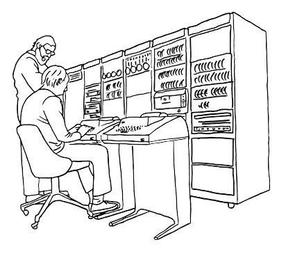

# Quarkus: 50 Shades of REST

REST is now 25 years old. The birth certificate of this almost impossible to 
remember acronym (*REpresentational State Transfer*) is considered to be the Y2K
doctoral dissertation of Roy Fielding, which aimed at creating a *standard* software
architecture, making easier the communication between systems using HTTP (*HyperText
Transfer Protocol*).

25 years is a long time and, at the IT scale, it's even much longer. We could 
think that, after a so long period of practising and testing, this paradigm has 
yielded up all its secrets. But no, screams often our daily activity, constraining
us to observe exactly the opposite.

Hence, the idea of this posts series which tries to address the essential aspects 
of this old, yet unknown, web technology, from its most basic features, like verbs
and resource naming conventions, to the most advanced ones, like non-blocking, 
asynchronous or reactive processing, together with the whole diversity of the REST
clients, blocking or non-blocking, synchronous or asynchronous, reactive or classic.

And since in order to illustrate my discourse I need code examples, I chose to
write them in Java, with its [supersonic subatomic dedicated stack](https://quarkus.io/), 
that doesn't need any longer presentation.

## A bit of history

In the begging there was nothing. Before the 70s, there weren't networks at all.
Computers were standalone boxes, like the one below, which didn't communicate 
each other. No files transfer, no remote access, no email, no internet, nothing.

### Arpanet, IBM SNA, DECnet and friends

This started to change in the beginning '70s with the birth of the ARPANET. 
But it wasn't until the end of the '70s that ARPANET became a backbone with 
several hundreds of nodes, using as processors minicomputers that later 
became routers. ARPANET was a network of networks, an inter-network, hence
the Internet that it became later.

ARPANET was based on TCP/IP (*Transmission Control Protocol/Internet Protocol*),
the first network protocol which continues to be the *lingua franca* of our 
nowadays internet. However, starting with the beginning of the '80s, other network
protocols have raised as well. Among the most famous IBM SNA (*System Network
Architecture* ) and DECnet (*Digital Equipment Coorportaion net*). They were both
proprietary, yet popular network architectures connecting mainframes, minicomputers
peripheral devices like teleprinters and displays, etc.

IBM SNA and DECnet have competed until early '80s when another one, OSI (*Open 
System Interconnect*), backed by European telephone monopolies and most governments,
was favored. Well-defined and supported by many state organizations, OSI became
quickly an ISO standard and was in the process of imposing itself on the market,
but it suffered from too much complexity and, finally, it gave way to TCP/IP which
was already a *de-facto* standard. Accordingly, at the end of the '80s, the network 
protocols war was finished and TCP/IP was the winner.

### RPC

But the network protocols wasn't the only war that took place in that period. 
Once that the computer networks became democratic and affordable, new distributed 
software applications started to emerge. These applications weren't designed 
anymore to run in a single isolated box but as standalone components, on different
nodes of the network. And in order to communicate, in order that local components
be able to call remote ones, software communication protocols were required.

The first major software communication protocol was RPC (*Remote Procedure Call*),
developed by SUN Microsystems in the 80s. One of the first problems that the 
distributed computing had to solve was the fact that, in order to perform a remote
call, the caller needs to capture the essence of the callee. A call to another
component, be it local or remote, needs to be compiled and, in order to be compiled, 
the callee procedure needs to be known by the compiler, such that it can translate
its name to a memory address. But when the callee is located on a different node
than the caller, the compiler cannot know the callee procedure since it is remote.
Hence the notion of *stub*, i.e. a local proxy of the remote procedure that, when
called, transforms the local call into remote one. 

Which means that, in order to call a remote procedure, in addition of the two 
components, the caller and the callee, a caller stub able to transform the local
call into a remote one, as well as a callee stub, able to transform the local return 
into a remote one, are required. These stubs are very complex artifacts and coding
them manually would have been a nightmare for the poor programmer. One of the 
greatest merits of RPC was to recognize the difficulty of such an undertaking and
to provide `genrpc`, a dedicated tool to generate the stubs using a standard 
format, named XDR (*eXternal Data Representation*), in a way the grandfather of
the nowadays' XML and JSON.

RPC was a big success as it proposed a rather straightforward model for distributed
applications development in C, on Unix operating system. But like any success, it 
has been forgotten as soon as other new and more interesting paradigm have 
emerged.

### DCOM

Nevertheless, the success of RPC has encouraged other software editors to take
a real interest in this new paradigm called henceforth *middleware* and which
allowed programs on different machines to talk each other. Microsoft, for example,
living up to its reputation, adopted RPC but modified it and, in the early '90s,
released a specific Windows NT version of it, known as MSRPC. Several years later,
in September 1996, Microsoft launched DCOM (*Distributed Component Object Model*).

Based on MSRPC and on RPC, which underlying mechanism it was using, DCOM imposed
itself as a new middleware construct supporting OOP (*Object Oriented Programming*).
The OOP support provided by DCOM was great progress compared with the RPC layer
as it allowed a higher abstraction level and to manipulate complex types instead 
of the XDR basic ones.

Unlike RPC and MSRPC accessible only in C, DCOM supported MS Visual C/C++ and 
Visual Basic. However, like all the Microsoft products, DCOM was tied to Windows 
and, hence, unable to represent a reliable middleware, especially in heterogeneous
environments involving different hardware, operating systems and programming languages.

### CORBA

The *Common Object Request Broker Architecture* is an OMG (*Object Management 
Group*) standard that emerged in 1991 and which aimed at bringing solutions to
the DCOM's most essential concerns, especially its associated vendor lock-in 
pattern that made its customer dependent on the Windows operating system.

As a multi-language, multi-os and multi-constructor platform, Corba was the first
true distributed object-oriented model. It replaced the `rpcgen` utility, inherited 
from RPC and MSRPC, by IDL (*Interface Definition Language*), a plain text notation.
And instead of the old XDR, the IDL compiler generated C++ or Java code directly.

Corba has definitely been a major player in the middleware history thanks to its
innovative architecture based on components like POA (*Portable Object Adapter*),
PI (*Portable Interceptors*), INS (*Interoperable Naming Service*) and many others.

But Corba was complex and required a quite steep learning curve. Its approach was
powerful but using it carelessly could have led to terrible applications, impacting
dramatically the infrastructure performances. Moreover, it was based on IIOP 
(*Internet Inter ORB Protocol*), an unfriendly firewall communication protocol
that used raw TCP:IP connections to transmit data.

All these aspects made feel like, despite Corba's great qualities, the community 
wasn't yet ready to adopt the first distributed object-oriented model.

### RMI

Positioned initially as the natural outgrowth of Corba, RMI (*Remote Method 
Invocation*) has been introduced with JDK (*Java Development Kit*) 1.1, in 1997.
One year later, JDK 1.2 introduced Java IDL and `idl2java`, the Java counterpart 
of Corba's IDL, supporting IIOP. 

In 1999, the RMI/IIOP extension to the JDK 1.2 enabled the remote access of any
Java distributed object from any IIOP supported language. This was a major 
evolution as it delivered Corba distributed capabilities to the Java platform.

Two years later, in 2001, the JDK 1.4 introduced support for POA, PI and 
INS, signing this way the Corba's death sentence. A couple of the most widespread
implementations, like Borland's VisiBroker or Iona's Orbix, have still subsisted
until 2003, when they got lost into oblivion.

From now on, Java RMI became the universal distributed object-oriented object model.

### Jakarta Enterprise Beans (EJB)

In 1999, SUN Microsystems has released the first version of what they're calling
the Java Enterprise platform, named a bit confusing J2EE (*Java 2 Enterprise 
Edition*). This new Java based framework was composed of 4 specifications: JDBC
(*Java Data Base Connection*), EJB (*Enterprise Java Beans*), Servlet and JSP 
(*Java Server Pages*). In 2006 J2EE became Java EE and, 11 years later, in 2017,
it changed again its name to become Jakarta EE.

Between 1999 and today, the Jakarta EE specifications have evolved dramatically.
Started with the previous mentioned 4 subprojects, they represent today more 
than 30. But the EJB specifications, currently named Jakarta Enterprise Beans,  
remain among the most the innovative Java APIs, the legitimate heir of Java RMI.

Enhanced under the JCP (*Java Community Process*) as JSR (*Java Specification 
Request*) 19 (EJB 2.0), JSR 153 (EJB 2.1), JSR 220 (EJB 3.0), JSR 318 (EJB 3.1)
and JSR 345 (EJB 3.2), these specifications provide even today the standard way
to implement the server-side components, often called the backend. They handle 
common concerns in enterprise grade applications, like security, persistence, 
transactional integrity, concurrency, remote access, race conditions management,
and others.

### Jakarta XML Web Services (JAX-WS)

While Jakarta Enterprise Beans compliant components were the standard solution 
to implement and encapsulate business logic, a new markup notation for storing, 
transmitting and reconstructing arbitrary data, has emerged. This notation, named 
XML (*eXtended Markup Language*), finished by being adopted as a standard by WWW
(*World Wide Web*) consortium, in 1999. And as that's often the case in the IT 
history, barely adopted, it immediately became so essential, so much so that it 
was quickly considered that any XML application was mandatory great. 

Consequently, it didn't need much to architectures boards to consider that 
exchanging XML documents, instead of RMI/IIOP Jakarta Enterprise Beans payloads,
would be easier and more proficient. It was also considered that Jakarta 
Enterprise Beans was heavy because it required stubs to be automatically downloaded
from servers to clients and, once downloaded, these stubs acted like client-side
objects, making remote calls. This required that the byte-code for the various
programmer-defined Java classes be available on the client machine and, this setup
was considered a significant challenge.

The alternative was the so-called *web services*, a newly coined concept supposed 
to simplify the distributed processing. According to this new paradigm, clients
and servers would exchange XML documents, i.e. text data. This documents grammar
is described by a new notation, called XSD (*XML Schema Defintion*), having the 
same capabilities as an object-oriented programming language, supporting inheritance,
polymorphism, etc. This XSD notation was to the web services what XDR was to RPC.

As for the interface contract between clients and servers, another new XML based 
notation, called WSDL (*Web Service Definition Language*), was required. Last but 
not least, the payload exchanged between clients and servers was expressed using a 
yet another new XML based notation, called SOAP (*Simple Object Access Protocol*)
which, despite its name, was anything but simple. The funy thing is that all this
huge labyrinth was considered simpler that the old good Jakarta Enterprise Beans
component.

Nevertheless, all this madness became standard in 2003, as JSR 101, known also
under the name of JAX-RPC (*Java API for XML-Based RPC*) and later, in 2017 as 
JSR 224, named JAX-WS (*Java API for XML-Based Services*). These specifications 
gave rise to a lot other, including but not limited to WS-I Basic Profile, WS-I
Attachments, WS-Addressing, SAAJ, etc.

### Jakarta RESTful Web Services (JAX-RS)

After this so convoluted piece of history, we come finally at the end of our 
journey, in 2009, when the specifications JAX-RS became a part of Java EE 6. Today,
in 2024, they are named Jakarta RESTful Web Services and are a part of Jakarta EE 11.
Since 15 years they represent the main substratum making service and microservices 
to communicate each-other, as well as with the external world.

In this post series we'll examine all their 50 shades :-).