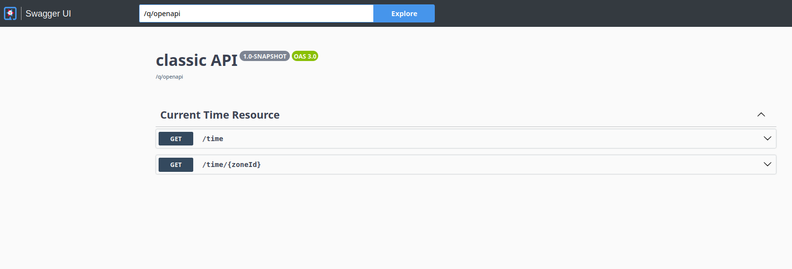

# The Classics

In Java, more precisely in Java Enterprise or, if you prefer, the *server side* 
Java, called today Jakarta EE, the REST web services come under the [Jakarta 
RESTfull Web Services](https://jakarta.ee/specifications/restful-ws/) specifications, formerly named JAX-RS (*Java API for Restful 
Web Services*). These specifications are considered as *classics* because they 
are the only existent ones, as far as Java is concerned. Other implementations 
exist, for example the one proposed by [Spring REST](https://docs.spring.io/spring-framework/reference/index.html) but,
as opposed to the Jakarta EE ones, defined under a formalised mechanism and 
maintained by big consortia, these specification-less open-source libraries are
guided by their maintainer's goals alone, not by the collabotation between 
companies, user groups and communities.

Jakarta REST (short for Jakarta RESTfull Web Services) is an old specification,
its 1.1 release being issued in 2009 under the Java EE 6 auspices. Its current 
version is the 4.0.0, published the 30th of April 2024, as a part of Jakarta EE 11.

Different editors have adopted it, over the years, and provided different 
implementations, of which among the most prominent are Apache CXF, Oracle Jersey
and Red Hat RESTeasy. It comes without surprise that Quarkus offers support for 
RESTeasy, via its `quarkus-rest*` extension set. 

REST, as proposed by Roy Fielding, is a protocol-agnostic architecture, however, 
all its major implementations use HTTP (*HyperText Transfer Protocol*) as its 
application layer protocol. HTTP has been designed on the purpose such that to 
provide request/response based interactions. Despite this particularity, which
could be considered a weakness, HTTP is nowadays ubiquitously used as front tier
to expose APIs consumable by other services.

The fact that HTTP, as an application layer protocol (HTTPS is a transport layer 
protocol), has been designed with this request/response pattern in mind, makes it 
intrinsically synchronous. In order to serve HTTP requests, an HTTP server is 
required. This server listens on a dedicated TCP port (8080 for example) and waits
for incoming requests. When it receives a new HTTP request the server parses it,
determines the HTTP method (for example GET, POST, etc.) as well as the path and 
the request's body. If HTTP filters or interceptors are present, then they will 
be executed, after which the endpoint aimed at processing the request will be 
looked up. Once this endpoint found, it will be invoked, the request is processed
and the result is captured in a HTTP response that will be sent back to the consumer.

As we can see, the described process is eminently synchronous. It implies that 
the same single thread is used for the entire request processing lifetime. This
is the most common and basic use case of the HTTP protocol. Let's look at a first
REST service example which leverages this pattern. 

## A simple REST service

In the `classic/` directory of the GitHub repository you'll
find a simple Quarkus application which exposes a REST service having two endpoints,
as follows:

  - an endpoint named `/time` which returns the current local date and time in the default time zone;
  - an endpoint named `/time/{zoneId}` which returns the current date and time in the time zone which ID is passed as path parameter.

The Listing 2.1 below shows a short code excerpt.

    @GET
    @Produces(MediaType.TEXT_PLAIN)
    public String getCurrentDateAndTimeAtDefaultZone()
    {
      return ZonedDateTime.now().format(DateTimeFormatter.ofPattern(FMT)
        .withZone(ZoneId.systemDefault()));
    }

Listing 2.1: A Simple Jakarta REST service with Quarkus

As you see, it couldn't be simpler. The endpoint above serves `GET` requests and
the result it produces is plain ASCII text. The 2nd endpoint is just as simple.
It servers `GET` requests as well but having as a path parameter a timezone ID.

## Testing the simple REST service

You can test this REST service by either running Quarkus in dev mode, using Maven
command `mvn quarkus:dev` or, if you prefer, by executing the *fast JAR*, as 
follows:

    $ cd classic
    $ mvn clean package
    $ java -jar target/quarkus-app/quarkus-run.jar

Listing 2.2: Running a Quarkus application as a Fast JAR

Once that the Quarkus application has started, be it in dev mode or running the 
*fast JAR*, you may either fire your preferred browser at one of the service's endpoints,
or use the `curl` command, as show below:

    $ curl http://localhost:8080/time && echo
    13 Oct 2024, 00:33:49 +02:00 CEST
    $ curl http://localhost:8080/time/Europe%2FMoscow && echo
    13 Oct 2024, 01:35:59 +03:00 MSK
    $ curl http://localhost:8080/time/America%2FNew_York && echo
    12 Oct 2024, 18:31:47 -04:00 EDT

Listing 2.3: Testing with curl

Another practical way to test this service is using Swagger UI. Just fire your
browser at `http://localhost:8080/s/swagger-ui/` and you'll be presented with 
the following screen:

Figure 2.1: Testing with Swagger UI

Here you can test the endpoints by clicking on the `GET` button and, then, 
selecting `Try out`.

## The unit tests

Testing REST endpoints with the `curl` utility or with Swagger UI is very 
practical,however, it requires manual operation. Despite being repetitive and 
fastidious, this is also error-prone. This is where the unit testing becomes very
important.

With Quarkus, unit testing has never been so easy. The `quarkus-junit5` extension
is required, as well as annotating your test classes with `@QuarkusTest`. All the
more so Quarkus integrates with [RESTassured](https://github.com/rest-assured/rest-assured),
a very well-known Java DSL (*Domain Specific Language*) for testing.

Bur REST is vast field and, hence, other test packages and libraries are used
since years. Accordingly, while testing Quarkus REST endpoints with RESTassured
becomes a formality, we cannot limit ourselves to only these kind of tests, and
we need to cover the full spectrum.

Consequently, we provide the following test categories with the endpoints samples:

  - RESTassured tests, as discussed above;
  - Eclipse MP REST Client tests. Eclipse MP (MicroProfile) is a relatively new project of the Eclipse Foundation which aims at optimizing the enterprise grade microservices architecture. As such, it defines a number of standards, one of which most important is REST Client, that dramatically simplifies the REST clients architecture.
  - Jakarta REST clients. Jakarta REST specifications, formerly JAX-RS, define a standard mechanism to invoke REST services. We're using it, among others, for tests purposes.
  - Java 11 HTTP Client. In its 11th release back in 2023, Java offers a new HTTP client API that might equally be used for test purposes.

All these test categories are integrated, of course, with JUnit 5. Let's have now a look at them all. 

### The RESTassured tests

This is probably the simplest and the most practical way to test REST endpoints.
The listing below shows an example.

    @QuarkusTest
    @TestInstance(TestInstance.Lifecycle.PER_CLASS)
    public class TestCurrentTimeResource extends BaseRestAssured
    {
      @TestHTTPEndpoint(CurrentTimeResource.class)
      @TestHTTPResource
      URL timeSrvUrl;

      @BeforeAll
      public void beforeAll() throws URISyntaxException
      {
        timeSrvUri = timeSrvUrl.toURI();
        assertThat(timeSrvUri).isNotNull();
      }

      @AfterAll
      public void afterAll()
      {
        timeSrvUri = null;
      }
    }

Listing 2.4: Testing with RESTassured

In order to factorize the common behaviour of the RESTassured based unit tests and
to minimize the amount of the boilerplate code, we defined a based class called
`BaseRestAssured` that contains recurrent in these tests. Hence, our test above 
extends this class.

The annotation `@QuarkusTest` which decorates this code is used to flag it as a
Quarkus unit test. The other annotation at the class level, `@TestInstance`, is
a JUnit 5 annotation, not a Quarkus one, and it aims at switching to the "class 
mode", from the default "method mode" of running tests. In "class mode" the JUnit
5 test executor is set such that to run all the test methods on the same class
instance, as opposed to the default "method mode" where each test is executed on 
its own class instance. The "class mode" has also the side effect of making 
possible to declare the methods `@BeforeAll` and `@AfterAll` as non static.

These methods are also JUnit 5 annotations, not Quarkus ones, and they are 
executed once, before and, respectively, after all the tests were run. Here we need
to handle the non static property `timeSrvUri` in the `@BeforeAll` method, meaning
that this method should be non static as well, hence the use of the annotation.

The couple of annotations `TestHTTPEndpoint` and `TestHTTPResource` are specific
Quarkus annotations and their role here is to capture the base URL of the endpoint
under the test. A web Quarkus application is, intrinsically, an HTTP server, running the
REST service defined in the current project. But if the host on which this HTTP
server runs will always be `localhost`, the TCP port on which the HTTP listener
is listening, which default value is 8080 or 8081, might be random. Hence, it's the role
of this couple of annotations to capture this information.

In our case, the `timeSrvUrl` property of type `URL` will have the value 
`http://localhost:<port-number>/time`, where `<port-number>` is the TCP port
number allocated by Quarkus upon running the test HTTP server
and which default value is 8081. This URL
is the one of to the REST service which class is passed as a parameter of the 
`@TestHTTPEndpoint` annotation, in this case `CurrentTimeResource`.

Now, the code of the base class `BaseRestAssured` is shown below:

    public class BaseRestAssured
    {
      private static final String FMT = "d MMM uuuu, HH:mm:ss XXX z";
      protected URI timeSrvUri;

      @Test
      public void testCurrentTime()
      {
        Response response = given().when().get(timeSrvUri);
        assertThat(response.statusCode()).isEqualTo(HttpStatus.SC_OK);
        assertThat(response.getBody()).isNotNull();
        assertThat(LocalDateTime.parse(response.prettyPrint(), 
          DateTimeFormatter.ofPattern(FMT)))
            .isCloseTo(LocalDateTime.now(), byLessThan(1, ChronoUnit.HOURS));
    }

    @Test
    public void testCurrentTimeWithZoneId()
    {
      Response response = given().baseUri(timeSrvUri.toString())
       .pathParam("zoneId", URLEncoder.encode("Europe/Kaliningrad", StandardCharsets.UTF_8))
       .when().get("{zoneId}");
      assertThat(response.statusCode()).isEqualTo(HttpStatus.SC_OK);
      assertThat(response.getBody()).isNotNull();
      assertThat(LocalDateTime.parse(response.prettyPrint(), 
        DateTimeFormatter.ofPattern(FMT)))
        .isCloseTo(LocalDateTime.now(), byLessThan(1, ChronoUnit.HOURS));
    }

Listing 2.5: The base class for RESTassured tests

The RESTassured syntax, in the most authentic DSL style, is clear and explicit. 
It leverages the "given-when" statements borrowed from the functional test notations
and, for this reason, is easy understandable. For example `given().when().get(timeSrvUri)`
sends a GET request to the endpoint which value is stored by the `timSrvUri` 
property. When a path parameter is required, for example, this becomes:

    given().baseUri(...).pathParam("zoneId", ...).when().get("{zoneId}")

Listing 2.6: Using the RESTassured DSL style to invoke endpoints

Easy, right ? A bit more complicated is the assertion:

    assertThat(LocalDateTime.parse(response.prettyPrint(), 
      DateTimeFormatter.ofPattern(FMT)))
        .isCloseTo(LocalDateTime.now(), byLessThan(1, ChronoUnit.HOURS));

Listing 2.7: Validation using AssertJ

We're using AssertJ, a library which complements JUnit 5 with more explicit 
assertions. Here we assert that the date and time returned by our endpoint
is less than 1 hour closed to the local date and time.

### The MP REST Client tests

MP REST Client is a specification which complements Jakarta REST and provides
a type-safe approach to invoke REST endpoints on HTTP. RESTeasy, as the
REST engine used by Quarkus, implements this specification via the `quarkus-rest-client`
extension. Also, a 2nd extension is required to provide support for JSON marshalling
and unmarshalling operations and here we have the choice between using [Jackson](https://github.com/FasterXML/jackson),
an open-source library supported by the community, or the standard [Jakarta JSON Binding](https://jakarta.ee/specifications/jsonb/)
(formerly JSON-B). We choose the standard, of course, hence the 
`quarkus-rest-client-jsonb` extension.

This having been said, using MP REST Client with Quarkus is as simple as creating
an interface matching the service's endpoints. If the service implements itself 
an interface, which is generally the case, then this same interface should be 
used for its clients. Let's see how things are working in our specific case.

The following interface is located in the `classic` directory of the GitHub 
project:

    @RegisterRestClient(configKey = "base_uri")
    @Path("time")
    public interface CurrentTimeResourceClient
    {
      @GET
      @Produces(MediaType.TEXT_PLAIN)
      String getCurrentDateAndTimeAtDefaultZone();
      @GET
      @Path("{zoneId}")
      @Produces(MediaType.TEXT_PLAIN)
      String getCurrentDateAndTimeAtZone(@PathParam("zoneId") String zoneId);
    }

Listing 2.8: The Eclipse MP REST Client interface

This is the interface that exposes the `CurrentTimeResource` REST service that 
we've seen previously in this chapter. The only new element is the annotation
`@RegisterRestClient` which signals to Quarkus at compile time that the given
interface is meant for being injected as a CDI (*Context and Dependencies Injection*)
component. The other annotations are the old good JAX-RS ones, renamed now as 
Jakarta REST.

And that's all ! At the compile time, the Quarkus REST processor performs a step
named "augmentation", during which it will generate the byte-code associated to the
REST client. Accordingly, in order to test a REST service, all that the unit test
needs to do is to inject the generated REST client via its interface, and to call
the endpoints. Look at the following listing:

    @QuarkusTest
    public class TestCurrentTimeResourceMpClient
    {
      @Inject
      @RestClient
      CurrentTimeResourceClient currentTimeResourceClient;
      private static final String FMT = "d MMM uuuu, HH:mm:ss XXX z";

      @Test
      public void testCurrentTime()
      {
        assertThat(LocalDateTime.parse(currentTimeResourceClient
         .getCurrentDateAndTimeAtDefaultZone(), DateTimeFormatter.ofPattern(FMT)))
           .isCloseTo(LocalDateTime.now(), byLessThan(1, ChronoUnit.HOURS));
      }

      @Test
      public void testCurrentTimeWithZoneId()
      {
        assertThat(LocalDateTime.parse(currentTimeResourceClient
         .getCurrentDateAndTimeAtDefaultZone(), DateTimeFormatter.ofPattern(FMT)))
           .isCloseTo(LocalDateTime.now(), byLessThan(1, ChronoUnit.HOURS));
      }
    }

Listing 2.9: Using an Eclipse MP REST Client in JUnit tests

As you can see, the annotation `@RestClient` injects the service's interface and
all that remains to do is to call the associated endpoints against that interface.

The sharp-eyed reader has probably observed that this unit test doesn't mention
any URL. This is because the `application.properties` file located in the 
`resources` directory contains the following property:

    base_uri/mp-rest/url=http://localhost:8081

It defines the default URL of the test HTTP server run by Quarkus. The name
`base_uri` is the one used as the value of the argument `configKey` of the 
`RegisterRestClient` annotation, as shown above.

### Jakarta REST Client tests

The initial releases of the Jakarta REST specifications, named at that time 
JAX-RS, didn't provide any provision for a specific API dedicated to clients and
consumers. In order to invoke REST endpoints, the preferred way was to use the
`java.net` package or the Apache HTTP Client library, which was quite difficult
as none of these APIs weren't "REST aware", meaning that the marshalling and
unmarshalling process was to be done manually.

Starting with the 2.0 release of the specifications, this issue has been corrected
as a new HTTP client API has been introduced. The different implementations of 
the specifications were from the beginning proposing client APIs but they were 
proprietary and using them would have the effect of the "vendor locked in"
antipattern.

The unit test class `TestCurrentTimeResouirceJakartaClient`, located in the `classic`
directory of the GitHub repository, illustrates the basics of this API:

    @QuarkusTest
    @TestInstance(TestInstance.Lifecycle.PER_CLASS)
    public class TestCurrentTimeResourceJakartaClient
    {
      ...
      @Test
      public void testTimeZoneResource()
      {
        try (Client client = ClientBuilder.newClient())
        {
          Response response = client.target(timeSrvUri).request().get();
          assertThat(response).isNotNull();
          assertThat(response.getStatus()).isEqualTo(HttpStatus.SC_OK);
          assertThat(LocalDateTime.parse(response.readEntity(String.class), DateTimeFormatter.ofPattern(FMT)))
           .isCloseTo(LocalDateTime.now(), byLessThan(1, ChronoUnit.HOURS));
        }
      }

      @Test
      public void testTimeZoneResourceWithTimeZone()
      {
        try (Client client = ClientBuilder.newClient())
        {
          Response response = client.target(timeSrvUri).path(URLEncoder.encode("Europe/Paris")).request().get();
          assertThat(response).isNotNull();
          assertThat(response.getStatus()).isEqualTo(HttpStatus.SC_OK);
          assertThat(LocalDateTime.parse(response.readEntity(String.class), DateTimeFormatter.ofPattern(FMT)))
           .isCloseTo(LocalDateTime.now(ZoneId.of("Europe/Paris")), byLessThan(1, ChronoUnit.HOURS));
      }
    }

Listing 2.9: Unit test with the JAX-RS 2.0 client

This unit test invokes GET requests on the two endpoints of our REST service. It
uses the class `jakarta.ws.rs.Client` and it may do it in a try-with-resources 
statement, as this class is an `AutoClosable`. The Jakarta REST Client API is
designed too as a DSL. Hence, the `target()` verb allows to define the endpoint
URL, while the `path()` one is used for path parameters. The result of the call
is an instance of the class `jakarta.ws.rs.core.Response` and the verb `readEntity()`
will extract from the response body the `String` instance containing the effective
result.
Please notice that the marshalling/unmarshalling operations are done automatically.
Our REST service consumes and produces `TEXT_PLAIN` data which is the simplest 
case of marshalling/unmarshalling, but would we have had endpoints consuming 
XML or JSON data, this would have been highly facilitated by the automatic
marshalling/unmarshalling provided by the API.

### Java 11 HTTP Server based tests

Released in 2023, Java 11 LTS (*Long Term Support*) introduces the JEP 321 defining
the new HTTP/2 API. Before that, the only way to invoke REST endpoints in a pure
Java way, without external 3rd party libraries and APIs, was the use of the 
`java.net.http.HttpClient` class. In addition to the HTTP/2 support, the Java 11 new API
brings also a WebSockets implementation and provides asynchronous processing via
Java 8 `CompletableFuture` class hierarchy.

The unit test class `TestCurrentTimeResouirceJava11Client`, located in the `classic`
directory of the GitHyb repository, illustrates the basics of this API:

    @QuarkusTest
    @TestInstance(TestInstance.Lifecycle.PER_CLASS)
    public class TestCurrentTimeResourceJava11Client
    {
      ...

      @Test
      public void testTimeZoneResource() throws Exception
      {
        try (HttpClient httpClient = HttpClient.newHttpClient())
        {
          HttpRequest request = HttpRequest.newBuilder().uri(timeSrvUri).GET().build();
          HttpResponse<String> response = httpClient.send(request, HttpResponse.BodyHandlers.ofString());
          assertThat(response).isNotNull();
          assertThat(response.statusCode()).isEqualTo(HttpStatus.SC_OK);
          assertThat(LocalDateTime.parse(response.body(), DateTimeFormatter.ofPattern(FMT)))
           .isCloseTo(LocalDateTime.now(), byLessThan(1, ChronoUnit.HOURS));
        }
      }

    @Test
    public void testTimeZoneResourceWithTimeZone() throws Exception
    {
      try (HttpClient httpClient = HttpClient.newHttpClient())
      {
        HttpRequest request = HttpRequest.newBuilder().uri(URI.create(timeSrvUri + "/" + URLEncoder.encode("Europe/Paris"))).GET().build();
        HttpResponse<String> response = httpClient.send(request, HttpResponse.BodyHandlers.ofString());
        assertThat(response).isNotNull();
        assertThat(response.statusCode()).isEqualTo(HttpStatus.SC_OK);
        assertThat(LocalDateTime.parse(response.body(), DateTimeFormatter.ofPattern(FMT)))
          .isCloseTo(LocalDateTime.now(ZoneId.of("Europe/Paris")), byLessThan(1, ChronoUnit.HOURS));
      }
    }

Listing 2.10: Unit test with Java 11 HTTP/2 API

The new HTTP Client API is based on the `HttpClient` 
class, as you can see in the listing above. The class `HttpRequest` and its 
`Builder` allows to construct specific HTTP requests, specifying headers, MIME
types, etc. Then the `send()` method is used to perform the request, `GET()` in
our case. The `HttpResponse.BodyHandlers.ofString()` statement in the example
defines the type of the expected response, `String` a in our case.

## Running the unit tests

The `classic` Maven project contains several unit tests. Talking about testing, one
final point is to consider the term of "unit test". Theoretically speaking, unit
tests are tests performed in perfect isolation, without any interaction with other
internal or external components or services. Mocking is the most common technique
used in unit testing as placeholders for real actors.

With Quarkus, we're speaking about a different kind of unit testing, something
between unit and integration testing. Quarkus unit tests run a very light embedded
Undertow web server on which the REST service under test is deployed. The readers
coming from Spring Boot will recognize here a similar model, with some key 
differences: 

  1. Quarkus is built around a reactive core, which is fundamentally different from the traditional servlet-based model used by default in Spring Boot.
  2. Quarkus's embedded Undertow server is more lightweight and optimized compared to Spring Boot's embedded Tomcat. 
  3. Quarkus is designed to support compilation to native code using GraalVM, which can eliminate the need for an embedded Undertow.

Nevertheless, running an embedded web server, be it a very light one, and deploying
on it the REST service under test, is not exactly the definition of what a unit
test does. Hence, the mention according to which Quarkus unit tests, like otherwise 
Spring Boot tests or in-container Jakarta EE ones, are at the halfway between 
unit and integration tests, makes sense. And they are neither full integration 
tests, as Quarkus provides the annotation `@QuarkusIntegrationTest` for these 
cases.

Now, having clarified these theoretical points, running the Maven test phase will display the following result:

    [INFO] -------------------------------------------------------
    [INFO]  T E S T S
    [INFO] -------------------------------------------------------
    [INFO] Running fr.simple_software.fifty_shades_of_rest.classic.tests.TestCurrentTimeResource
    2024-10-28 16:16:30,764 WARN  [io.qua.config] (main) Unrecognized configuration key "quarkus.rest-client-reactive.base_uri.url" was provided; it will be ignored; verify that the dependency extension for this configuration is set or that you did not make a typo
    2024-10-28 16:16:31,215 INFO  [io.quarkus] (main) classic 1.0-SNAPSHOT on JVM (powered by Quarkus 3.15.1) started in 2.552s. Listening on: http://localhost:8081
    2024-10-28 16:16:31,215 INFO  [io.quarkus] (main) Profile test activated.
    2024-10-28 16:16:31,215 INFO  [io.quarkus] (main) Installed features: [cdi, reactive-routes, rest, rest-client, rest-client-jsonb, rest-jsonb, smallrye-context-propagation, smallrye-openapi, swagger-ui, vertx]
    28 Oct 2024, 16:16:32 +01:00 CET
    28 Oct 2024, 17:16:32 +02:00 EET
    [INFO] Tests run: 2, Failures: 0, Errors: 0, Skipped: 0, Time elapsed: 6.075 s -- in fr.simple_software.fifty_shades_of_rest.classic.tests.TestCurrentTimeResource
    [INFO] Running fr.simple_software.fifty_shades_of_rest.classic.tests.TestCurrentTimeResourceJakartaClient
    [INFO] Tests run: 2, Failures: 0, Errors: 0, Skipped: 0, Time elapsed: 0.183 s -- in fr.simple_software.fifty_shades_of_rest.classic.tests.TestCurrentTimeResourceJakartaClient
    [INFO] Running fr.simple_software.fifty_shades_of_rest.classic.tests.TestCurrentTimeResourceJava11Client
    [INFO] Tests run: 2, Failures: 0, Errors: 0, Skipped: 0, Time elapsed: 0.172 s -- in fr.simple_software.fifty_shades_of_rest.classic.tests.TestCurrentTimeResourceJava11Client
    [INFO] Running fr.simple_software.fifty_shades_of_rest.classic.tests.TestCurrentTimeResourceMpClient
    [INFO] Tests run: 2, Failures: 0, Errors: 0, Skipped: 0, Time elapsed: 0.040 s -- in fr.simple_software.fifty_shades_of_rest.classic.tests.TestCurrentTimeResourceMpClient
    2024-10-28 16:16:33,012 INFO  [io.quarkus] (main) classic stopped in 0.181s
    [INFO]
    [INFO] Results:
    [INFO]
    [INFO] Tests run: 8, Failures: 0, Errors: 0, Skipped: 0
    [INFO]
    [INFO] ------------------------------------------------------------------------
    [INFO] BUILD SUCCESS
    [INFO] ------------------------------------------------------------------------
    [INFO] Total time:  12.485 s
    [INFO] Finished at: 2024-10-28T16:16:33+01:00
    [INFO] ------------------------------------------------------------------------

Listing 2.11: Running unit tests with Maven

Here we can see that all the unit tests have been successfuly executed.

## The synchronous communication drawbacks

As we already mentioned, using synchronous communication for REST services, as 
well as for web services in general, is very common. You send a request and wait 
for the associated response. While synchronous processing is easy to understand
and to reason about because the code structure is sequential, it has a drawback:
it leads to *time coupling*. This is one of the most complex form of coupling 
consisting in the fact that it requires all the participants and the network to
be operational for the complete duration of the exchange.

But this isn't the case in the real live where the nodes we want to interact with
might not be reachable, or they are reachable but fail to process the request, or 
even worst, the nodes are reachable, they succeed to receive and process the requests
but the network connection is lost while the responses are written back to the consumers.

We can simulate all these outcomes using a Quarkus interceptor that catches up 
the network traffic and inserts different HTTP headers in the incoming requests
and the outgoing responses, such that to simulate failures or to introduce delays
and loses.

### A fault simulator

The class `FaultSimulator` in the `failures` module of our Maven project performs
the operations described above. It has been inspired by an example provided by 
the book [Reactive Systems in Java](https://shorturl.at/CfQpq) by Clément Escoffier and Ken Finnigan.
Looking at the code, you can see the following
`enum` structure which defines all the failure types that can happen:

    private enum Fault
    {
      NONE,
      INBOUND_REQUEST_LOSS,
      SERVICE_FAILURE,
      OUTBOUND_RESPONSE_LOSS
    }

Listing 2.12: The class Fault used to simulate HTTP failures

Here we have the following categories:

  - no failure (`NONE`)
  - the request is lost between the consumer and the producer (`INBOUND_REQUEST_LOSS`)
  - the producer receives the request but fails to process it (`SERVICE_FAILURE`)
  - the consumer receives and processes the request but fails to write it back to the consumer (`RESPONSE_LOSS`)

The `FaultSimulator` is a CDI (*Contexts and Dependency Injection*) bean having 
an application scope and being decorated with the `@Route` annotation, to serve
and endpoint named `fail`. It takes the following query parameters:

  - the type of failure: `INBOUND_REQUEST_LOSS`, `SERVICE_FAILURE`, `OUTBOUND_REQUEST_LOSS`. `NONE` is the default value.
  - the fault ratio: a value in the interval [0, 1) defining how much percent of the requests will randomly fail. 0.5 is the default value.

To illustrate the synchronous communication drawback you need first to start the 
Quarkus application, in either dev mode or as a *fast JAR*, for example:

    $ cd classic
    $ mvn clean package
    $ java -jar target/quarkus-app/quarkus-run.jar

Listing 2.13: Runnin the Quarkus application as a Fast JAR

Then, use the `curl` command below in order to configure the `FaultSimulator` to 
lose 50% of the incoming requests:

    curl http://localhost:8080/fail?failure=INBOUND_REQUEST_LOSS && echo
    Faults are enabled: fault = INBOUND_REQUEST_LOSS, failure rate = 0.5

Listing 2.14: Configuring FaultSimulator to lose 50% of trafic

Now let's test again our service endpoints `/time` and `/time/{zoneId}` as we 
did previously:

    $ curl --max-time 5 http://localhost:8080/time && echo
    13 Oct 2024, 17:27:00 +02:00 CEST
    $ curl --max-time 5 http://localhost:8080/time && echo
    curl: (28) Operation timed out after 5001 milliseconds with 0 bytes received

Listing 2.15: Producing INBOUND_REQUEST_LOSS failure

We've been lucky, in only two trials we managed to get a timeout after 5 
seconds (the `--max-time` parameter) as if the HTTP request has never attended 
the producer. Now, let's try the 2nd type of failure:

    $ curl http://localhost:8080/fail?failure=SERVICE_FAILURE
    Faults are enabled: fault = SERVICE_FAILURE, failure rate = 0.5
    $ curl http://localhost:8080/time && echo
    FAULTY RESPONSE!

Listing 2.16: Producing SERVICE_FAILURE

Here again we've been lucky as we managed to get from the first try the faulty 
response, showing that, this time, the request has successfully been received 
by the producer, but it failed to process, whatever the reason might be.

Last but not least:

    $ curl http://localhost:8080/fail?failure=OUTBOUND_RESPONSE_LOSS
    Faults are enabled: fault = OUTBOUND_RESPONSE_LOSS, failure rate = 0.5
    $ curl http://localhost:8080/time && echo
    curl: (52) Empty reply from server

Listing 2.17: Producing OUTBOUND_RESPONSE_LOSS failure

Now the network connection has been abruptly closed before the response reaches 
the consumer.

These examples aim at helping to understand the impact of not only the 
uncertainty of certain communication operations, but also to illustrate the strong
coupling induced by the synchronous request/response based pattern. This type of 
communication is often used because of its simplicity, but it only works if all 
the infrastructure elements are simultaneously operational, which is never the 
case in the real live.

So, what are the options in that case ? Well, we can still continue to use sync
communication and to try to gracefully manage exceptional conditions using time-
outs, retries, etc. For example, the following `curl` command:

    $ curl --max-time 5 --retry 100 --retry-all-errors http://localhost:8080/time && echo
    curl: (52) Empty reply from server
    Warning: Problem (retrying all errors). Will retry in 1 seconds. 100 retries
    Warning: left.
    13 Oct 2024, 18:01:32 +02:00 CEST

Listing 2.18: Gracefully handling synchronous communication

This command waits during maximum 5 seconds for a result and, failing that, it 
exits on time-out. It will retry 100 times, every second or until success. And as
a matter of fact, you can see that, during the first invocation, the HTTP response
is lost before attending the consumer. Never mind, we'll try again in a sec and,
this time, we're successful. 

So, this would be one of the options: synchronous communication gracefully 
handled. But there is another option, more interesting: using asynchronous
communication. This is what we'll be seeing in the next sections.